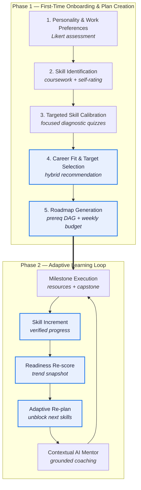

# Masar — مسار

> **An Intelligent Career Guidance and Skill-Gap Analysis System for Computer Science Students**

Masar tells a Computer Science student three things they cannot easily get anywhere else:
**which technology career actually fits them**, **exactly which skills they are missing for it**,
and **an ordered, time-boxed plan to close that gap** — recalculated every time they make progress.

|                     |                                                                                                   |
| ------------------- | ------------------------------------------------------------------------------------------------- |
| **Institution**     | Suez Canal University — Faculty of Computers & Informatics                                        |
| **Department**      | Computer Science                                                                                  |
| **Supervisor**      | Dr. Hend Shabaan                                                                                  |
| **Team**            | 8 members ([roles](docs/01-project-overview.md#7-team--responsibilities))                         |
| **Duration**        | 20 Sep 2026 → 20 May 2027 (35 weeks)                                                              |
| **Mid-term review** | 1 Nov 2026 (Week 7)                                                                               |
| **Final review**    | 20 May 2027 (Week 35)                                                                             |
| **Budget**          | **0 EGP / $0** — free tiers and open data only ([ADR-0005](docs/adr/0005-zero-budget-hosting.md)) |

---

## Documentation index

Read in this order if you are new to the project. Every document is self-contained
and owns exactly one concern, so two people can edit two documents without conflicting.

| #   | Document                                                | What it answers                                                                                        | Primary owner           |
| --- | ------------------------------------------------------- | ------------------------------------------------------------------------------------------------------ | ----------------------- |
| 01  | [Project Overview](docs/01-project-overview.md)         | Why this project exists, what is in and out of scope, who does what, what already exists in the market | Abdelrahman             |
| 02  | [Requirements](docs/02-requirements.md)                 | Personas, user stories with acceptance criteria, functional (FR) and non-functional (NFR) requirements | Abdelrahman + Yousef K. |
| 03  | [Architecture](docs/03-architecture.md)                 | Services, boundaries, auth, request flows, deployment topology                                         | Abdelrahman             |
| 04  | [Data Model](docs/04-data-model.md)                     | ERD, the skill taxonomy, career→track→skill model, prerequisite DAG, seed data and its licences        | Mohamed Y. + Osama      |
| 05  | [MVP Features](docs/05-features-mvp.md)                 | Every MVP feature with its algorithm, worked example, acceptance criteria and fallback                 | Backend + Frontend      |
| 06  | [AI Engines](docs/06-ai-engines.md)                     | The three AI engines, model choices, deterministic baselines, prompt design, safety, cost budget       | Ahmed Y. + Ziad         |
| 07  | [API Contract](docs/07-api-contract.md)                 | Endpoints, DTOs, error envelope — frozen early so frontend and backend can work in parallel            | Abdelrahman             |
| 08  | [Plan & Timeline](docs/08-plan-and-timeline.md)         | Priority matrix, 12 vertical slices with real dates, milestones, Definition of Done, RACI              | Abdelrahman             |
| 09  | [Evaluation](docs/09-evaluation.md)                     | How we prove the system works — datasets, metrics, baselines, the user study                           | Ahmed Y.                |
| 10  | [Risks & Assumptions](docs/10-risks-and-assumptions.md) | What can go wrong, the trigger for each, who owns the mitigation                                       | Abdelrahman             |
| 11  | [Glossary](docs/11-glossary.md)                         | Shared vocabulary — use these exact terms in code, docs and the report                                 | All                     |
| 12  | [References](docs/12-references.md)                     | Citable sources for the report                                                                         | Ahmed Y.                |
| —   | [Decision records (ADR)](docs/adr/)                     | Why we chose PostgreSQL, which models, where the job data comes from                                   | Abdelrahman             |
| —   | [Team Meetings](meetings/)                              | Meeting records, standup cadence, and sprint kickoffs                                                  | Abdelrahman             |

Diagram sources live in [`docs/diagrams/`](docs/diagrams/). Superseded documents live in
[`archive/`](archive/). Verification scripts live in [`scripts/`](scripts/).

---

## The core value loop

Masar guides a student through two distinct, interconnected phases:



1. **Phase 1 (Onboarding):** A student discovers their career fit without friction. They start with an intuitive interest/work-preference assessment, record their academic courses and technical skills, take focused benchmark quizzes on their core claimed skills, and receive an explainable career ranking with an ordered roadmap.
2. **Phase 2 (Growth Loop):** As the student completes roadmap milestones, their skill levels increment, readiness scores update dynamically, subsequent dependencies are unblocked, and the AI mentor provides grounded guidance.

---

## Current status

| Phase          | State                                                                        |
| -------------- | ---------------------------------------------------------------------------- |
| Specification  | **In Review** — restructured from the original single-file spec into `docs/` |
| Implementation | Not started — begins Week 1 (20 Sep 2026)                                    |

Open items before implementation starts, all tracked in
[10 — Risks & Assumptions](docs/10-risks-and-assumptions.md#3-assumptions-register):

- **Week 1** — confirm the chosen free Postgres host supports the `pgvector` extension ([A7](docs/10-risks-and-assumptions.md#3-assumptions-register))
- **Week 1** — request the department course catalogue from Dr. Hend ([A1](docs/10-risks-and-assumptions.md#3-assumptions-register))
- **Week 2** — freeze the [API contract](docs/07-api-contract.md)

---

## Working agreements

- **Branches:** `main` is protected. Work on `feat/<slice>-<short-name>`, `fix/…`, `docs/…`.
- **Pull requests:** at least one review before merge. No direct pushes to `main`.
- **Definition of Done:** see [08 — Plan](docs/08-plan-and-timeline.md#6-definition-of-done). A feature is not
  done until it is deployed to staging, covered by tests, and reachable from the UI.
- **Documentation is part of the change.** If a PR alters behaviour described in `docs/`, it updates `docs/`.
- **Verify documentation before pushing:**

  ```bash
  python3 scripts/check-links.py .          # relative links and heading anchors
  npm i --no-save mermaid@11 jsdom
  node scripts/check-mermaid.mjs .          # every mermaid block parses
  npx markdownlint-cli2 "**/*.md"           # formatting
  ```

  All three also run in CI on every pull request.

- **Terminology:** use the [Glossary](docs/11-glossary.md). Do not invent synonyms for `skill`, `gap`, `track`, or `readiness`.
- **Secrets never enter the repository.** Use environment variables and the deployment provider's secret store.

---

*Masar — Graduation Project, Department of Computer Science, Faculty of Computers & Informatics,
Suez Canal University. Supervised by Dr. Hend Shabaan.*