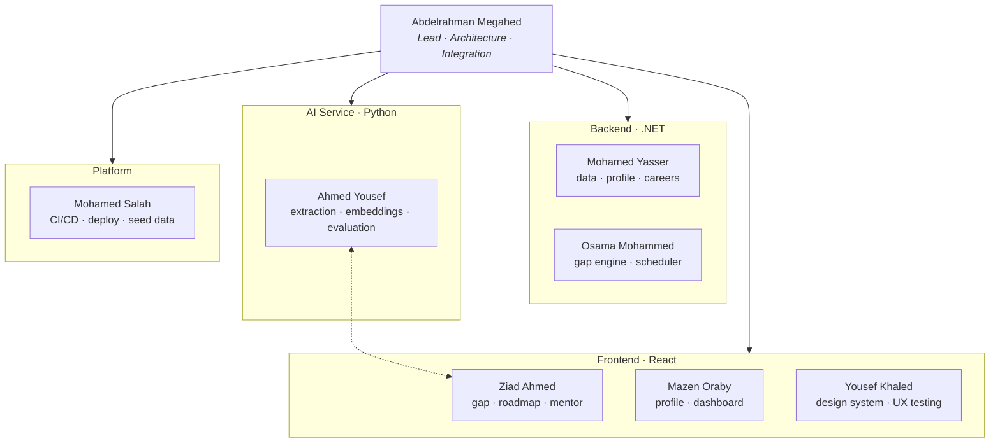

# 01 — Project Overview

**Document owner:** Abdelrahman Megahed · **Status:**  Under Review

---

## 1. Project information

| Field | Details |
|---|---|
| **Title (EN)** | Masar: An Intelligent Career Guidance and Skill-Gap Analysis System for Computer Science Students |
| **Title (AR)** | مسار: نظام ذكي للإرشاد المهني وتحليل الفجوات المهارية لطلاب علوم الحاسب |
| **Institution** | Suez Canal University — Faculty of Computers & Informatics |
| **Department** | Computer Science |
| **Supervisor** | Dr. Hend Shabaan |
| **Team size** | 8 |
| **Timeline** | 20 Sep 2026 → 20 May 2027 |
| **Type** | Graduation Project |

---

## 2. Problem definition

A Computer Science student approaching graduation faces four distinct problems. They are
usually discussed as one vague problem ("students don't know what to do"), which is why
existing tools solve none of them well.

| # | Problem | Why existing options fail |
|---|---|---|
| P1 | **Choosing a specialization.** Backend, AI, data, security, cloud, mobile — a student cannot evaluate a path they have never worked in. | Career quizzes ask about personality, not demonstrated technical ability, and return a label with no next step. |
| P2 | **Knowing which skills the market actually wants.** Job posts are inconsistent, and requirements drift faster than any curriculum. | Static "roadmaps" are hand-written, undated, and identical for every student regardless of what they already know. |
| P3 | **Connecting university coursework to industry requirements.** A student who passed a databases course does not know that this already covers most of a "SQL" requirement. | No tool knows what the student's own department actually taught them. |
| P4 | **Turning a gap into a plan.** Knowing you are weak at Docker does not tell you what to study first, for how long, or in what order. | Course platforms recommend more courses; they do not sequence prerequisites or produce portfolio evidence. |

**The specific gap Masar addresses:** there is no system that takes a student's *actual*
skill state, compares it against *current* market requirements for a *specific* role, and
returns a *prerequisite-ordered, time-boxed* plan that updates as the student progresses.

---

## 3. Objectives and how each is delivered

Every objective maps to at least one feature and at least one requirement. An objective with
no feature is not an objective — it is a wish. This traceability is what makes the project defensible.

| # | Objective | Delivered by | Verified by |
|---|---|---|---|
| **O1** | Assess technical skills, interests and preferences | [Student Profile](05-features-mvp.md#51-student-profile), [Calibration Quiz](05-features-mvp.md#52-skill-calibration-quiz) | FR-01…FR-06 |
| **O2** | Recommend suitable career paths | [Career Recommendation](05-features-mvp.md#54-career-recommendation) | FR-10, [RQ1](09-evaluation.md#rq1--does-semantic-matching-beat-keyword-matching) |
| **O3** | Analyse job requirements to identify demanded skills | [Job-Skill Extraction](06-ai-engines.md#2-engine-a--job-skill-extraction), [Curriculum Mapping](05-features-mvp.md#511-university-curriculum-mapping) | [RQ2](09-evaluation.md#rq2--how-accurate-is-skill-extraction) |
| **O4** | Identify gaps against a target career | [Skill-Gap Analysis](05-features-mvp.md#55-skill-gap-analysis--core) | FR-12…FR-15 |
| **O5** | Generate learning paths and project recommendations | [Roadmap](05-features-mvp.md#56-personalized-roadmap--core), [Projects](05-features-mvp.md#58-project-recommendations) | FR-16…FR-22 |
| **O6** | Track progress and update recommendations | [Progress Tracking](05-features-mvp.md#59-progress-tracking), [Readiness Score](05-features-mvp.md#57-career-readiness-score) | FR-23…FR-26 |
| **O7** | Provide an AI-assisted mentor | [AI Mentor](06-ai-engines.md#4-engine-c--context-aware-ai-mentor-rag) | FR-27…FR-29, [RQ4](09-evaluation.md#rq4--is-the-mentor-grounded) |
| **O8** | Help students prepare for internships and entry-level roles | [Internship Readiness](05-features-mvp.md#512-internship-readiness-checklist) | FR-30 |
| **O9** | Give faculty visibility into cohort-level skill gaps | [Advisor Dashboard](05-features-mvp.md#513-advisor-dashboard) | FR-31…FR-33 |

> **O9 is new.** It costs little once gap analysis exists, adds a second user role, and turns
> Masar from a student toy into something the Faculty could actually adopt. It is also the
> easiest way to answer "who would use this at scale?" in the defence.

---

## 4. Scope

Writing this down prevents the most common graduation-project failure: quietly growing the
scope until nothing is finished.

### In scope (MVP)

- Career guidance for **6 technology career paths** (see [§04](04-data-model.md#52-seed-careers))
- **Computer Science students** at Suez Canal University as the primary audience
- **English** UI, with Arabic-ready infrastructure ([NFR-13](02-requirements.md#nfr-13--internationalisation-readiness))
- A **web application** — responsive, usable on a phone browser
- A **frozen, documented snapshot** of job-posting data, not live scraping ([ADR-0003](adr/0003-job-data-sourcing.md))

### Explicitly out of scope

| Not doing | Why |
|---|---|
| Live job scraping at scale | Legal grey area, unstable, and would sit on the critical path. [ADR-0003](adr/0003-job-data-sourcing.md) |
| Real job matching / applications | Requires employer relationships we do not have |
| Non-technology careers | The skill taxonomy would not transfer |
| Native mobile apps | A responsive web app covers the need at a fraction of the cost |
| Payments, subscriptions, monetisation | No budget, no legal entity |
| Video content or an authored course library | We link to existing free resources instead |
| Multi-university tenancy | One faculty's curriculum is enough to prove the idea |

---

## 5. Expected contribution

Masar connects three things that are normally disconnected: **what a student can do**,
**what their university taught them**, and **what employers are asking for**.

Four contributions are genuinely defensible in a thesis:

1. **A hybrid career-matching method** — a deterministic weighted-overlap baseline combined
   with an embedding-based semantic re-ranker, where the contribution of the semantic layer
   is *measured* rather than assumed ([RQ1](09-evaluation.md#rq1--does-semantic-matching-beat-keyword-matching)).
2. **Curriculum-to-skill mapping.** Mapping an actual department's course catalogue onto a
   market skill taxonomy, so a transcript becomes a starting skill profile. We are not aware
   of a commercial product that does this, and it directly addresses P3.
3. **Prerequisite-aware, time-budgeted roadmap generation.** A deterministic scheduler over a
   skill DAG that turns an hours-per-week budget into a dated weekly plan — not an unordered
   list of topics.
4. **Regional market weighting.** Skill importance computed from Egypt/MENA postings alongside
   global postings, exposing where local demand diverges. Cheap once the corpus exists, and it
   makes the recommendations meaningfully local.

### Where AI sits, precisely

The original specification contradicted itself, calling AI both "the core intelligence engine"
and "an enabling component, not the product itself." The resolved position:

> **AI provides the intelligence for interpretation and matching. Deterministic logic owns
> every decision that must be correct, ordered, or explainable.**

| Concern | Owned by | Rationale |
|---|---|---|
| Skill extraction from free text | **AI** (NLP) | Unstructured input; no rule set generalises |
| Career matching / re-ranking | **AI + deterministic baseline** | AI improves recall; the baseline guarantees an answer |
| Gap classification | **Deterministic** | Must be reproducible and explainable to the student |
| Roadmap ordering | **Deterministic** (topological sort) | An LLM cannot be trusted to respect prerequisites |
| Resource selection | **Curated database** | An LLM will confidently generate dead URLs |
| Explanation and mentoring | **AI** (RAG) | Natural language over data the system already computed |

Every AI component has a documented non-AI fallback
([§06 Fallbacks](06-ai-engines.md#7-fallbacks-and-graceful-degradation)).
The demo cannot fail because a rate limit was hit.

---

## 6. Related work

The report needs this section, and knowing it prevents rebuilding something that already exists.
Full citations in [§12](12-references.md).

| System | What it does | What it does not do |
|---|---|---|
| **roadmap.sh** | Excellent hand-curated role roadmaps | Identical for everyone; no assessment, no gap analysis, no progress-aware re-planning |
| **LinkedIn Skills / Learning** | Skill tags and course suggestions from a huge graph | Optimises for engagement; no prerequisite sequencing; not tied to a student's transcript |
| **Coursera / Udemy recommenders** | Recommend courses | Recommend *their own* catalogue; no career gap model; commercial incentive |
| **Interest/personality career quizzes** | Interest profiling | No technical skill assessment; output is a label, not a plan |
| **O\*NET / ESCO** | Authoritative occupation↔skill taxonomies, public and free | Reference data, not a product; occupation-level and slow-moving; not student-facing |
| **ATS / résumé scanners** | Keyword-match a CV against a posting | Post-hoc; tells you that you failed, not what to learn |

**Masar's position:** the only system combining *measured* student skills, *the student's own
curriculum*, and *current market demand* into a *sequenced, adaptive* plan.

---

## 7. Team & responsibilities

Every MVP-critical component has a **primary** and a **secondary** owner. Single-owner
components are how graduation projects die when one person hits an exam week.

| Member | Role | Primary responsibilities | Backs up |
|---|---|---|---|
| **Abdelrahman Megahed** | Team Lead · Full-Stack | Architecture, [API contract](07-api-contract.md), integration, releases, project tracking | Floating capacity |
| **Mohamed Yasser** | .NET Backend | Data model, EF Core layer, Profile + Assessment + Career services | Osama |
| **Osama Mohammed** | .NET Backend | **Gap engine**, **roadmap scheduler**, progress service | Mohamed Y. |
| **Ahmed Yousef** | AI / ML | Skill extraction, embeddings, [evaluation](09-evaluation.md) | Ziad |
| **Ziad Ahmed** | Frontend · AI integration | AI Mentor integration, gap + roadmap UI, AI service client | Ahmed Y., Mazen |
| **Mazen Oraby** | Frontend | Profile, assessment, dashboard, resource and project views | Ziad |
| **Yousef Khaled** | UI/UX | Design system, wireframes, prototypes, **usability testing**, accessibility | Mazen |
| **Mohamed Salah** | DevOps | CI/CD, containers, staging + production deploys, seed-data pipeline, backups | Abdelrahman |

### Ownership map

### Cross-cutting workstreams

These were unowned in the original plan, and they are exactly the work that gets dropped.

| Workstream | Owner | Support |
|---|---|---|
| **Data curation** — careers, skills, resources, projects | Mohamed Yasser | Mazen, Yousef K. |
| **Prerequisite DAG authoring** + cycle detection | Osama | Ahmed Y. |
| **QA & test strategy** | Ziad | Mohamed Salah |
| **Evaluation & user study** | Ahmed Yousef | Yousef K. |
| **Report & presentation** | Abdelrahman | All |

Full task-level assignment with dates is in [§08](08-plan-and-timeline.md).

---

## 8. One-sentence definition

> **Masar** measures a Computer Science student's current skills, recommends technology career
> paths that fit them, quantifies exactly which skills they lack for a chosen path, and
> generates a prerequisite-ordered, time-budgeted learning and project plan that re-adapts
> every time they complete something.

---

**Next:** [02 — Requirements](02-requirements.md)
