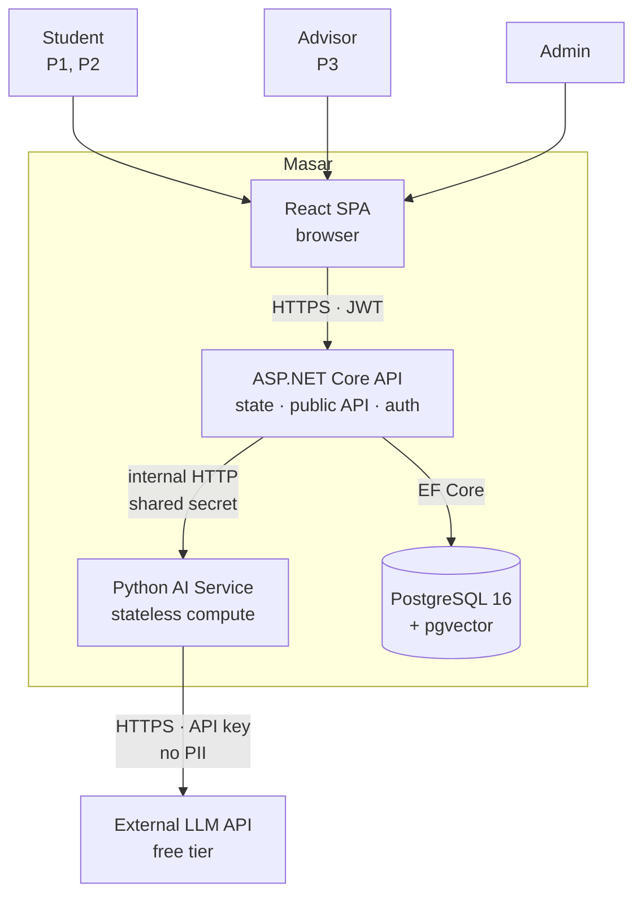
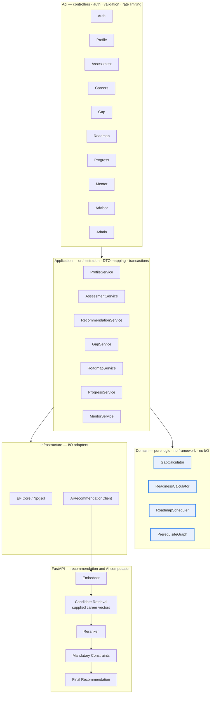
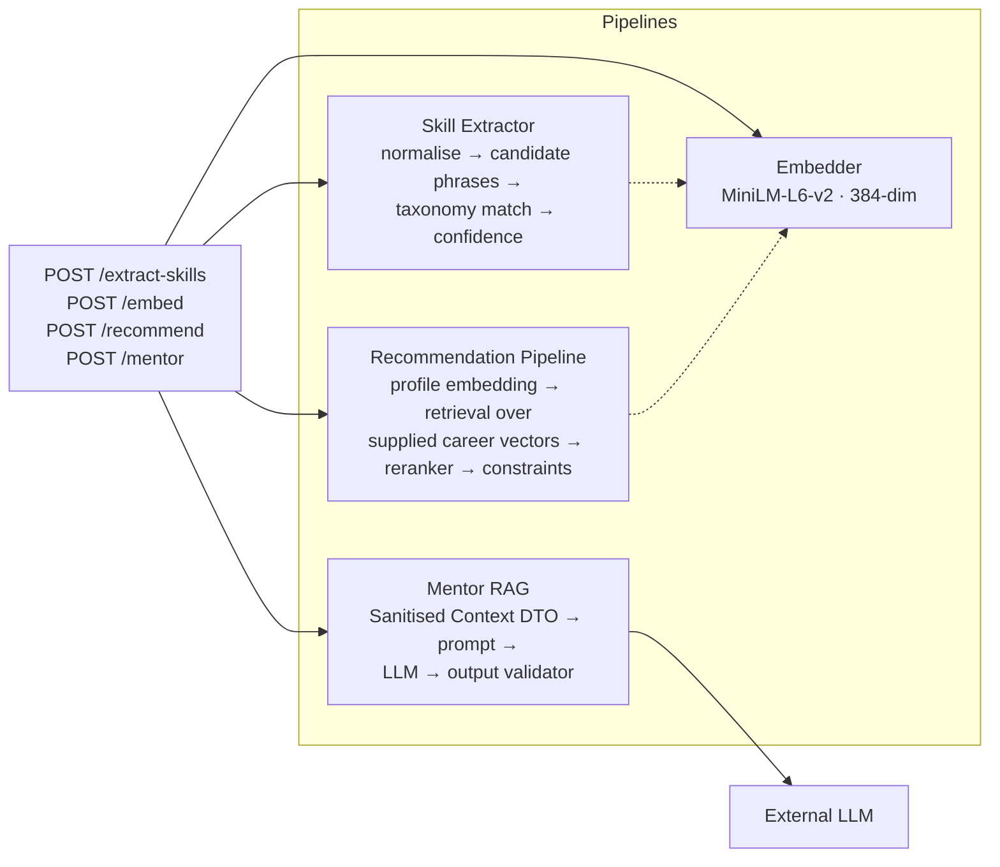
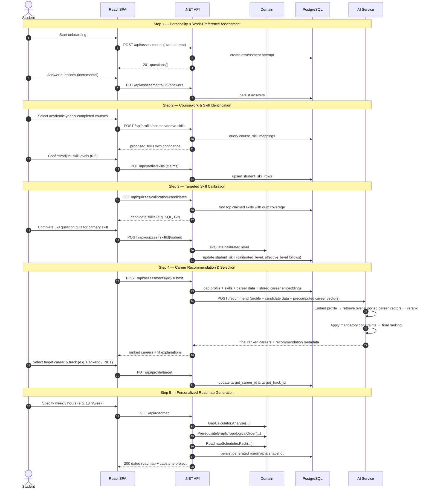
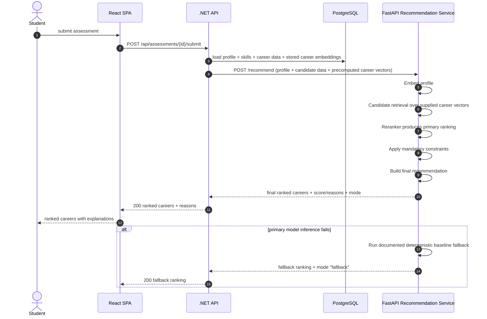
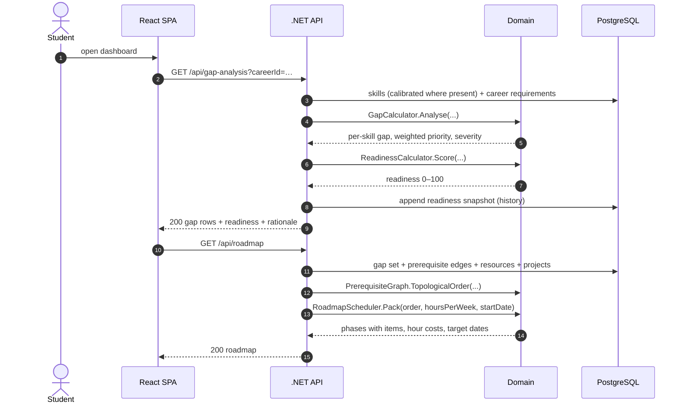
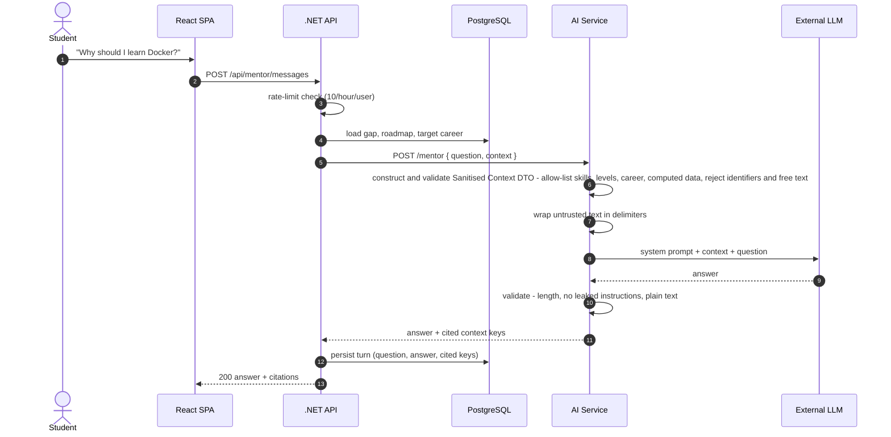
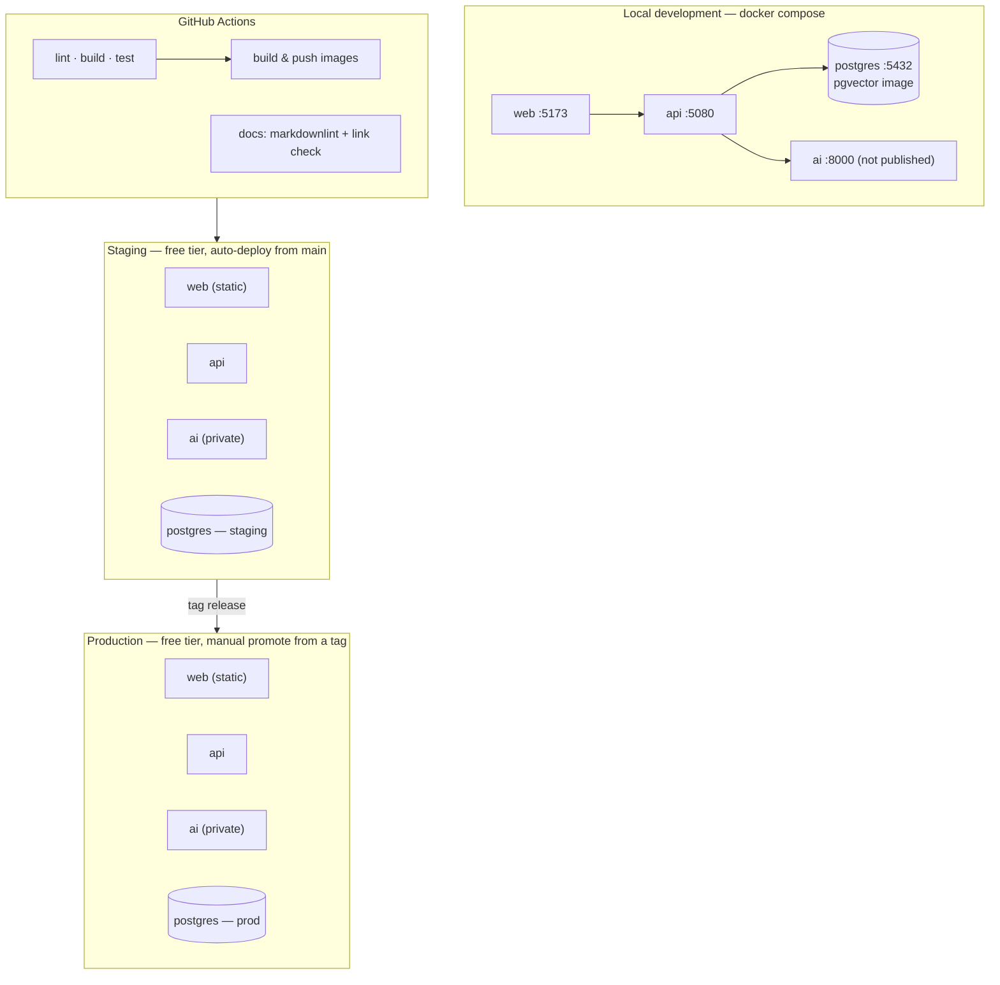

# 03 — Architecture

**Document owner:** Abdelrahman Megahed · **Status:** Baseline

---

## 1. Technology stack

| Layer | Choice | Why | Owner |
|---|---|---|---|
| Frontend | **React 19 + TypeScript + Vite** | Team's existing skill; TypeScript makes the [API contract](07-api-contract.md) enforceable at compile time | Ziad, Mazen |
| UI | **Tailwind CSS + Radix UI primitives** | Radix provides accessible components out of the box, which is how [NFR-05](02-requirements.md#nfr-05--accessibility) becomes achievable rather than aspirational | Yousef K. |
| Charts | **Recharts** | Needed for the readiness trend and the cohort heatmap | Mazen |
| Backend | **ASP.NET Core 10 Web API (C#)** | Team's existing skill; active LTS release | Mohamed Y., Osama |
| ORM | **EF Core 10 + Npgsql** | Migrations, plus `Pgvector.EntityFrameworkCore` for vector columns | Mohamed Y. |
| Database | **PostgreSQL 16 + pgvector** | One store for both relational and vector data — see ADR-0001 | Mohamed Y. |
| AI service | **Python 3.12 + FastAPI** | The NLP/embedding ecosystem is Python in practice | Ahmed Y. |
| Embeddings | **sentence-transformers `all-MiniLM-L6-v2`** — 384 dimensions, ~23 M parameters, Apache-2.0, CPU-only | Small enough for a free CPU tier, and the licence permits this use | Ahmed Y. |
| LLM | **Free-tier hosted API**, provider-abstracted — see ADR-0002 | $0 budget; the abstraction lets the provider be swapped without touching features | **Ahmed Y.** |
| Containers | **Docker + docker compose** | One-command local setup ([NFR-14](02-requirements.md#nfr-14--portability)) | Mohamed Salah |
| CI/CD | **GitHub Actions** | Free for public repositories | Mohamed Salah |
| Hosting | Free tiers — see ADR-0005 | $0 budget | Mohamed Salah |

> **Rule:** no dependency is added without a named reason and a pinned version. `latest` is banned
> in Dockerfiles, and lockfiles are committed.

---

## 2. Why three services and not one

A single .NET application would be simpler, and simpler is usually right. It is not right here for
one specific reason: the embedding and NLP libraries the project needs are Python. Running them
through ONNX inside .NET is possible, but that would place the riskiest, least familiar work
directly on the critical path of the component two other people depend on.

The split is therefore drawn on a **language boundary, not a scalability boundary**:

- **.NET owns all application state and public API responsibilities.** It is the only service that talks to the database and is responsible for loading persisted career/skill data, including precomputed embeddings, before calling the AI service.
- **FastAPI owns stateless AI and career-recommendation computation.** Recommendation work includes profile embedding, candidate retrieval over supplied candidate data/vectors, reranking, mandatory constraints, and the final ranking. **The AI Mentor intelligence also lives here, including construction/validation of the Sanitised Context DTO, RAG/prompt construction, LLM provider abstraction, output validation, and AI fallback logic.** It stores nothing and does not access the database directly.
- **React owns presentation only.** No business rules in the client.

This keeps the Python service focused. Career and skill embeddings are generated at seed time and persisted by the
.NET/data layer in PostgreSQL. For recommendation requests, .NET loads the required candidate data and stored career
embeddings, then sends them to FastAPI. FastAPI performs per-request profile embedding, candidate retrieval,
reranking, mandatory constraints, and final recommendation without accessing PostgreSQL directly.

---

## 3. System context

Note what is **not** in this diagram: the browser never talks to the AI service, and the AI service
never talks to the database. Both omissions are deliberate.

---

## 4. Backend internals

For recommendation requests, `AiRecommendationClient` sends the profile plus candidate career data and
precomputed career embeddings that `.NET` loaded from PostgreSQL. The vector payload is an input to FastAPI
candidate retrieval; FastAPI never queries PostgreSQL.

**The highlighted `Domain` classes are the project's intellectual core.** They are pure functions
over plain objects: no `DbContext`, no `HttpClient`, no `DateTime.Now` (time is injected). That is
what makes [NFR-12](02-requirements.md#nfr-12--testability)'s 80 % coverage target realistic rather
than painful, and it is what lets the final report present the algorithms without infrastructure noise.

Dependency rule, enforced by project references: `Api → Application → Domain`, and
`Application → Infrastructure`. **`Domain` references nothing.** If `Domain` ever needs a database,
the design has drifted.

---

## 5. AI service internals

Properties that matter:

- **Stateless.** No database, no session. It can be restarted or replaced at any moment.
- **The model loads once at startup**, not per request. Cold start is roughly 10 s on free CPU hardware; the readiness probe accounts for this.
- **Every endpoint is synchronous and bounded.** No background jobs, no message queues — nothing extra to debug the night before a review.

---

## 6. Service-to-service authentication

The AI service must never be reachable from the internet. If it were, anyone could burn the LLM
free-tier quota, which under a $0 budget means taking the mentor offline for everyone.

| Control | Implementation |
|---|---|
| Network | AI service bound to the internal network only, with no public route. In `docker compose` its port is not published; on the hosting provider it is a private service. |
| Shared secret | Every request from .NET carries `X-Masar-Service-Key`. The AI service rejects any request without an exact match, using a constant-time comparison, and returns `401` with no detail. |
| Secret storage | Environment variable, injected by the platform's secret store. Never committed, and rotated if it is ever printed in a log. |
| Timeouts | .NET client: 20 s timeout, 2 retries with backoff; if the primary model inference still fails while FastAPI is available, FastAPI returns the documented deterministic fallback ([NFR-09](02-requirements.md#nfr-09--abuse-and-cost-control)). |
| Logging | Request ID propagated as `X-Correlation-Id` so one student action can be traced across all three services. |

> If the chosen host cannot provide private networking on its free tier, the shared secret becomes
> the only control. That is documented as **R-08** in [§10](10-risks-and-assumptions.md) with
> IP allow-listing as the mitigation.

---

## 7. Key request flows

### 7.0 End-to-end onboarding and plan creation flow

The complete end-to-end journey for a first-time student, tying together assessment, skill capture, calibration, career recommendation, and roadmap generation:

### 7.1 Career recommendation — model-first, with a FastAPI fallback

Career prediction and recommendation are computed inside the internal FastAPI service. The .NET
backend remains responsible for loading the required data, calling the service, and returning the
public API response. FastAPI does not access PostgreSQL directly.

The model is the primary prediction mechanism. The deterministic baseline is retained for evaluation
and as the documented FastAPI fallback; it is not the production primary predictor.

### 7.2 Gap analysis and roadmap — fully deterministic

**No AI call appears anywhere in this flow.** The two MVP-core features are pure computation,
which means they are fast, reproducible, unit-testable, and impossible to break with an expired
API key. This is the single most important structural change from the original specification.

### 7.3 AI mentor — RAG with a privacy boundary

The sanitisation and allow-list validation step inside FastAPI is a requirement, not an optimisation:
[NFR-08](02-requirements.md#nfr-08--privacy-and-data-protection) forbids sending student
identifiers to a third party.

---

## 8. Deployment topology

Rules:

- **`main` auto-deploys to staging.** Every merge is visible to the whole team within minutes; nobody has to ask "is it deployed?".
- **Production is promoted from a tag, manually.** Reviews and the defence run against production, so it never moves unexpectedly.
- **Staging and production have separate databases.** Seed and reset staging freely; never point a script at production.
- **Migrations run as an explicit deployment step**, never automatically on application startup — an auto-migration on a cold start under a free tier is a way to corrupt a database live.

---

## 9. Environments and configuration

| Setting | Local | Staging | Production |
|---|---|---|---|
| Database | container | free managed Postgres | free managed Postgres |
| LLM | mock by default, real if a key is present | real, free tier | real, free tier |
| Embeddings | real (CPU) | real (CPU) | real (CPU) |
| Seed data | full, resettable | full, resettable | seeded once |
| Demo mode | available | available | **available** |
| Log level | Debug | Information | Warning |

Configuration comes from environment variables only. No `appsettings.Production.json` with real
values in the repository. Required variables are listed in `.env.example`, and the API fails fast
at startup with a clear message if one is missing — a missing variable should break the boot, not
the third page of the demo.

---

## 10. Demo mode

Insurance for the two sessions that actually count (1 Nov 2026 and 20 May 2027).

When `MASAR_DEMO_MODE=true`:

- Authentication accepts three fixed seeded accounts (`student`, `advisor`, `admin`).
- A fixed student profile with known skills is loaded, so the gap table and readiness score are known in advance.
- The AI service returns recorded fixture responses; **no external network calls are made**.
- The mentor answers from a small recorded transcript covering the questions demonstrated.

This means the demo runs from a laptop with the network unplugged. Given free-tier sleep
behaviour ([NFR-03](02-requirements.md#nfr-03--availability)), this is not paranoia — it is the
difference between a smooth defence and a cold-start timeout in front of the committee.

---

## 11. What we are deliberately not building

Named so nobody "helpfully" adds them at week 20.

| Not building | Why | What we do instead |
|---|---|---|
| Message queue / broker | Nothing is asynchronous | Synchronous, bounded calls |
| Redis / distributed cache | 500 users, and embeddings are cached in Postgres | In-memory cache with a short TTL |
| Microservice-per-feature | 8 people and 35 weeks | Three services on a language boundary |
| Kubernetes | Free tiers do not offer it, and it is not needed at this scale | docker compose locally, platform deploys remotely |
| GraphQL | REST plus a typed client is enough | OpenAPI-generated TypeScript client |
| WebSockets / live updates | No collaborative or real-time feature | Request/response |
| Event sourcing / CQRS | Would add weeks of ceremony for no gain | Straight CRUD plus pure domain calculators |
| Separate vector database | pgvector covers the scale — ADR-0001 | pgvector in the same Postgres instance |

---

**Next:** [04 — Data Model](04-data-model.md)
