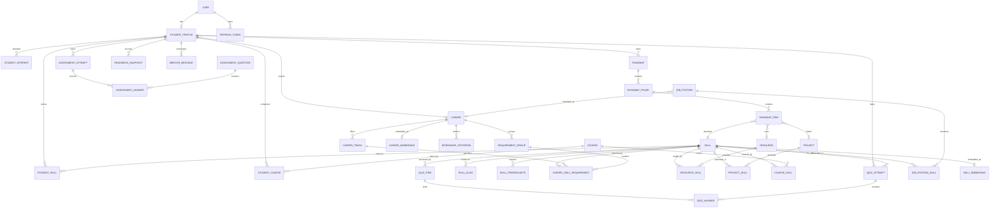
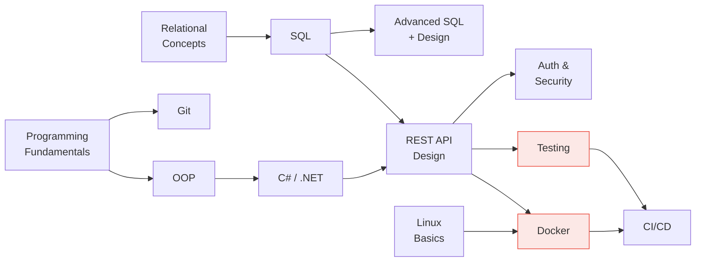

# 04 — Data Model

**Document owners:** Mohamed Yasser, Osama Mohammed · **Status:** Baseline

This document defines the vocabulary the entire system computes on. Get it wrong and every
downstream feature inherits the error, so it is worth more argument than any UI decision.

---

## 1. Design decisions that matter

Four choices here differ from the original specification. Each fixes a defect that would have
produced visibly wrong output in the demo.

| # | Decision | Problem it fixes |
|---|---|---|
| D1 | Proficiency is an **integer 0–5 with written definitions**, not a percentage | "SQL 55 %" implies a precision self-assessment cannot deliver, and invites meaningless arithmetic. A student can pick between six described levels; nobody can honestly pick between 55 % and 60 %. |
| D2 | A career has **tracks**, and requirements can be **OR-groups** | The original example required "Python 90 %" for Backend Development. A .NET student would be told they have a Python gap, which is wrong and would embarrass the demo in front of a .NET-literate committee. |
| D3 | Skills have **canonical names plus aliases** | Job postings say "Postgres", "PostgreSQL", "psql", "Postgre SQL". Without aliases, extraction produces four skills where there is one. |
| D4 | Prerequisites are a **graph with enforced acyclicity**, stored separately from careers | Ordering is a property of the skill domain, not of a career. Sharing one graph means authoring it once instead of six times. |

---

## 2. Entity-relationship diagram



---

## 3. The proficiency scale

One scale, used everywhere: student levels, career requirements, resource levels, quiz outcomes.
Mixing scales is how gap arithmetic silently becomes nonsense.

| Level | Name | Definition shown to the student |
|:-:|---|---|
| **0** | None | I have never used this. |
| **1** | Aware | I know what it is and could describe roughly what it does. |
| **2** | Guided | I have used it by following a tutorial or with help. |
| **3** | Independent | I can use it on my own for a coursework-sized task. |
| **4** | Proficient | I can use it on a substantial project, debug problems, and explain trade-offs. |
| **5** | Advanced | I can teach it, review others' use of it, and reason about its internals. |

Rules:

- Stored as `smallint`, constrained `0..5`. Never a float, never a percentage.
- The definition text is displayed **next to the input**, not in a help modal. A rating scale nobody reads produces noise.
- Career requirements use the same scale, so `gap = required − current` is meaningful.
- Percentages appear **only** in the readiness score and career match score, where they are computed values with a stated formula — never as user input.

---

## 4. The skill taxonomy

### 4.1 Canonical skills and aliases

```text
SKILL
  id, canonical_name, slug, category, description,
  typical_learning_hours, is_active

SKILL_ALIAS
  id, skill_id, alias, source     -- source: 'manual' | 'onet' | 'esco' | 'extraction'
```

- `canonical_name` is the single name shown in the UI. **"PostgreSQL", never "Postgres".**
- `slug` is the stable machine key used in seed files and tests (`postgresql`), so renaming a display name never breaks a fixture.
- Aliases are the extraction pipeline's join key. Every alias is unique across the whole table — one string cannot map to two skills.
- `category` groups skills for display: `Language`, `Framework`, `Database`, `Tooling`, `Cloud`, `Practice`, `Theory`, `Soft`.
- `typical_learning_hours` is the scheduler's cost estimate for reaching level 3 from level 0. Hours between adjacent levels are derived in [§7.3](#73-hour-estimates).

**Target size for the MVP: 120–160 canonical skills.** Fewer looks thin; more cannot be curated
properly by 8 people, and an unmaintained taxonomy is worse than a small one.

### 4.2 Prerequisite graph

```text
SKILL_PREREQUISITE
  skill_id, prerequisite_skill_id, strength   -- 'hard' | 'soft'
  PRIMARY KEY (skill_id, prerequisite_skill_id)
```

- **`hard`** — genuinely cannot be learned first (Docker before Kubernetes). The scheduler must respect these.
- **`soft`** — better in this order but not required (SQL before ORMs). The scheduler prefers them but may reorder under time pressure.
- **Acyclicity is enforced.** A seed-time validator runs a topological sort and **fails the build** if a cycle exists. Without this check, roadmap generation can loop forever — and it will, the first time someone adds an edge carelessly.
- Edges are authored once and shared by all careers.



### 4.3 Skill embeddings

```text
SKILL_EMBEDDING
  skill_id PK, embedding vector(384), model_name, model_version, generated_at
```

- 384 dimensions, matching `all-MiniLM-L6-v2` ([§03](03-architecture.md#1-technology-stack)).
- Generated **at seed time** and stored. Never computed per request ([NFR-01](02-requirements.md#nfr-01--performance)).
- `model_name` and `model_version` are stored so a model change is detectable. Comparing vectors produced by two different models yields confidently wrong similarity scores with no error message.
- Index: `USING hnsw (embedding vector_cosine_ops)`.

---

## 5. Careers, tracks and OR-groups

This is decision **D2**, and it is the most important structural fix in this document.

```text
CAREER
  id, name, slug, summary, long_description, is_active

CAREER_TRACK
  id, career_id, name, slug, is_default
  -- e.g. Backend Development → ".NET", "Node.js", "Python", "Java"

REQUIREMENT_GROUP
  id, career_id, track_id NULL, name, kind, min_satisfied
  -- kind: 'all' | 'any_of'      'any_of' + min_satisfied = 1 means "one of these is enough"

CAREER_SKILL_REQUIREMENT
  id, career_id, track_id NULL, group_id NULL, skill_id,
  required_level (0..5), importance (0.0..1.0), rationale
```

### 5.1 How OR-groups are evaluated

For an `any_of` group the gap calculator:

1. Computes each member's satisfaction, `min(current, required) / required`.
2. Selects the member with the **highest** satisfaction as the *representative*.
3. Reports only the representative's gap and marks the others `not_applicable`.

Result: a student strong in C# who targets Backend Development is told they have **no primary
language gap**. Under the original flat model they would have been told to learn Python. That
single behaviour is the difference between advice a student trusts and advice they dismiss.

### 5.2 Seed careers

Six careers, each with tracks. Chosen because they cover the realistic destinations of a CS
graduate in Egypt and are distinguishable by skills rather than by job-title fashion.

| # | Career | Tracks | Approx. required skills |
|---|---|---|---|
| 1 | **Backend Development** | .NET · Node.js · Python · Java | 18–22 |
| 2 | **Frontend / Full-Stack** | React · Angular | 18–22 |
| 3 | **AI / Machine Learning** | Classical ML · Deep Learning | 20–24 |
| 4 | **Data Engineering / Data Science** | Analytics · Pipelines | 18–22 |
| 5 | **Cybersecurity** | AppSec · Network / SOC | 18–22 |
| 6 | **DevOps / Cloud** | AWS · Azure | 20–24 |

> Full-Stack was separated from Backend deliberately. The original list contained both
> "Software / Full-Stack Development" and "Backend Development" with heavily overlapping skill
> sets, which would have produced nearly identical match scores — and a recommender whose top two
> results are indistinguishable looks broken.

### 5.3 Importance weights

`importance ∈ [0, 1]` — how much this skill matters for this career. Computed as a blend, so the
number is defensible rather than invented:

```text
importance = 0.5 · normalised_posting_frequency   -- from the job corpus
           + 0.3 · taxonomy_weight                -- O*NET / ESCO
           + 0.2 · expert_weight                  -- team + supervisor judgement
```

- Every requirement stores its computed `importance` **and** a human-readable `rationale`, reused by both the gap explanation and the AI mentor.
- Weights are recomputed only when the job-corpus snapshot changes, never at request time.
- The blend is documented and reproducible — exactly the kind of thing a committee asks about.

### 5.4 Career embeddings

```text
CAREER_EMBEDDING
  career_id PK, embedding vector(384), source_text, model_name, model_version, generated_at
```

`source_text` is the exact string that was embedded (career summary plus weighted skill names).
Storing it means a similarity result can always be explained after the fact, which is otherwise
impossible to reconstruct.

---

## 6. Student data

```text
USER
  id, email UNIQUE, password_hash, email_confirmed, role, created_at
  -- role: 'Student' | 'Advisor' | 'Admin'

STUDENT_PROFILE
  id, user_id UNIQUE, academic_year, target_career_id NULL, target_track_id NULL,
  hours_per_week, career_goal_text,
  onboarding_step (1..5) DEFAULT 1,
  onboarding_completed_at TIMESTAMP NULL,
  consent_advisor_visibility BOOL DEFAULT false,
  consent_research_use     BOOL DEFAULT false,
  created_at, updated_at

STUDENT_SKILL
  id, profile_id, skill_id,
  self_level (0..5),
  calibrated_level (0..5) NULL,
  effective_level (0..5) GENERATED,        -- COALESCE(calibrated, self)
  source,          -- 'self' | 'quiz' | 'course_map' | 'progress' | 'evidence'
  evidence_url NULL, evidence_verified BOOL,
  updated_at
  UNIQUE (profile_id, skill_id)
```

`effective_level` exists so **no consumer ever has to decide which level to trust**. Every
downstream calculation reads one column. This eliminates an entire class of bug where the gap
engine uses the self-reported value while the roadmap uses the calibrated one.

Both consent flags default to `false`, satisfying
[NFR-08](02-requirements.md#nfr-08--privacy-and-data-protection). Advisor aggregation reads only
profiles where `consent_research_use` or `consent_advisor_visibility` is true, depending on the view.

```text
STUDENT_COURSE   id, profile_id, course_id, grade NULL, completed_term
STUDENT_INTEREST id, profile_id, interest_id, weight (1..5)

READINESS_SNAPSHOT
  id, profile_id, career_id, score (0..100), captured_at
  -- append-only; powers the trend chart (FR-26)
```

`READINESS_SNAPSHOT` is append-only and never updated. It is what turns "adaptive" from a claim in
the abstract into a visible line on a chart during the defence.

### 6.1 Assessment and calibration data

```text
ASSESSMENT_QUESTION
  id, code, category, prompt, min_label, max_label, sequence, is_active
  -- category: 'interest' | 'work_style' | 'problem_type' | 'career_intent'

ASSESSMENT_ATTEMPT
  id, profile_id, started_at, completed_at NULL, status
  -- status: 'in_progress' | 'completed' | 'abandoned'

ASSESSMENT_ANSWER
  id, attempt_id, question_id, score (1..5), answered_at
  UNIQUE (attempt_id, question_id)

QUIZ_ITEM
  id, skill_id, target_level (1..5), question_text,
  options_json, correct_option_index, explanation, is_active

QUIZ_ATTEMPT
  id, profile_id, skill_id, started_at, completed_at NULL,
  calibrated_level (0..5) NULL, is_passed BOOL

QUIZ_ANSWER
  id, attempt_id, quiz_item_id, selected_option_index, is_correct, answered_at
  UNIQUE (attempt_id, quiz_item_id)
```

- **Separation of concerns:** `ASSESSMENT_QUESTION` models the 20–25 Likert-scale personality, preference, and interest items feeding the career interest vector. `QUIZ_ITEM` models technical multiple-choice items tied to specific skills and target proficiency levels.
- **Resilience:** `ASSESSMENT_ANSWER` records answers as they are selected, enabling students to pause and resume the onboarding wizard without data loss.
- **Auditability:** `QUIZ_ATTEMPT` and `QUIZ_ANSWER` retain an objective record of test outcomes, explaining why a calibrated level was assigned.

---

## 7. Content: courses, resources, projects, roadmaps

### 7.1 Courses — the curriculum bridge

```text
COURSE
  id, code, title, credit_hours, academic_year, term, is_elective
  -- e.g. 'CS302', 'Database Systems'

COURSE_SKILL
  course_id, skill_id, coverage_level (0..5), confidence (0.0..1.0)
  -- coverage_level: the level a student who passed this course plausibly reaches
```

This table is contribution #2 from [§01](01-project-overview.md#5-expected-contribution) and the
project's clearest novelty.

- Authored from the department's official course descriptions, with the supervisor validating the mapping. That validation is what makes it citable rather than anecdotal.
- `confidence` records how strongly the course implies the skill. `CS302 → SQL` is high confidence; `CS302 → Data Modelling` is moderate.
- Course-derived levels are **proposals only**. The student confirms or edits each one (US-11 AC2). Silently asserting a skill the student does not feel they have destroys trust in the entire profile.
- Proposed level = `round(coverage_level × confidence)`, never exceeding `coverage_level`.

### 7.2 Learning resources

```text
RESOURCE
  id, title, url, provider, type, level (0..5),
  estimated_hours, language, is_free, cost_note,
  last_verified_at, is_active

RESOURCE_SKILL
  resource_id, skill_id, is_primary
```

- **Curated, never LLM-generated.** An LLM will produce a plausible URL that 404s, and it will do so during the demo.
- `is_free` is required, and **every MVP-seeded resource must be free** — the students using this have the same $0 budget the team does.
- `last_verified_at` supports a link-check job. Dead links in a roadmap make the product look abandoned.
- `type`: `docs` | `course` | `video` | `article` | `book` | `exercise` | `tutorial`.
- **Target: 250–350 resources**, at least 2 per skill that can appear in a roadmap.

### 7.3 Hour estimates

The scheduler needs a cost per level transition. Derived from `SKILL.typical_learning_hours`
(defined as level 0 → 3) using a fixed distribution, so estimates stay consistent across 160
skills instead of being guessed row by row:

| Transition | Share of base hours |
|---|---|
| 0 → 1 | 10 % |
| 1 → 2 | 20 % |
| 2 → 3 | 30 % |
| 3 → 4 | 40 % |
| 4 → 5 | 60 % |

Reaching level 3 in a 40-hour skill costs `40 × (0.10 + 0.20 + 0.30) = 24 h`; moving from level 2
to 4 costs `40 × (0.30 + 0.40) = 28 h`. Higher levels cost more, which matches how learning
actually works and stops the scheduler from cheerfully promising level 5 in a week.

### 7.4 Projects

```text
PROJECT
  id, title, description, difficulty (1..5),
  estimated_hours, deliverables, is_capstone_eligible

PROJECT_SKILL
  project_id, skill_id, is_primary, min_level_required
```

- Projects are selected by **gap coverage**: how many of the student's gap skills a project exercises, weighted by priority ([§05](05-features-mvp.md#58-project-recommendations)).
- `min_level_required` prevents recommending a project the student cannot start.
- **Target: 40–60 projects**, at least 4 per career, spanning difficulty 1–5.

### 7.5 Roadmaps

```text
ROADMAP
  id, profile_id, career_id, track_id,
  generated_at, hours_per_week, algorithm_version, input_hash, is_current

ROADMAP_PHASE
  id, roadmap_id, sequence, title, estimated_hours, target_start_date, target_end_date

ROADMAP_ITEM
  id, phase_id, sequence, skill_id, from_level, to_level,
  resource_id NULL, project_id NULL, estimated_hours,
  status,            -- 'pending' | 'in_progress' | 'completed' | 'skipped'
  completed_at NULL
```

Two fields carry unusual weight:

- **`input_hash`** — a hash of every input (skill levels, career, track, hours per week, algorithm version). It is how FR-18's determinism requirement is actually *tested*: the same hash must produce the same roadmap. It also lets the API skip regeneration when nothing has changed.
- **`algorithm_version`** — old roadmaps stay explainable after the scheduler changes. Without it, a bug report from week 20 cannot be reproduced.

---

## 8. Job corpus

```text
JOB_POSTING
  id, source, source_id, title, raw_text, company_size NULL,
  region,            -- 'EG' | 'MENA' | 'GLOBAL'
  seniority,         -- 'intern' | 'junior' | 'mid' | 'senior' | 'unknown'
  career_id NULL, collected_at, snapshot_version

JOB_POSTING_SKILL
  posting_id, skill_id, confidence (0.0..1.0), extracted_by, matched_alias
```

- **`snapshot_version` is mandatory.** All weights are computed from one frozen, versioned snapshot so results are reproducible for the report. A moving corpus makes every number in the thesis unverifiable.
- `region` enables the regional-weighting contribution (#4 in [§01](01-project-overview.md#5-expected-contribution)).
- `seniority` matters more than it looks: importance weights come from **intern/junior** postings, not senior ones. Weighting a fresh graduate's roadmap by senior requirements produces demoralising, useless output — an easy mistake to make and a hard one to notice.
- `matched_alias` records *which* alias matched, making extraction errors debuggable instead of mysterious.
- **Target: 500–800 postings**, at least 80 per career.

---

## 9. Seed data sources and licences

[NFR-15](02-requirements.md#nfr-15--legal-and-licensing) requires this table, and the report needs it.

| Source | Content used | Licence | Obligation |
|---|---|---|---|
| **O\*NET Database** (U.S. DoL / ETA) | Occupation→skill and Technology Skills mappings, as taxonomy seed | **CC BY 4.0** | Attribution in the app footer and in the report |
| **ESCO** (European Commission) | Occupation and skill/competence concepts, multilingual labels, alias seed | Free download in CSV/RDF/JSON-LD; reuse under the Commission's terms | Attribution, with the ESCO version recorded |
| **Job postings** | A frozen snapshot for frequency weighting | Per-source terms — see [ADR-0003](adr/0003-job-data-sourcing.md) | Store raw text only where terms allow; otherwise store extracted skills plus a link |
| **Curated resources** | Titles and URLs only | Not applicable — links only | No content copied |
| **Department course catalogue** | Codes, titles, descriptions | Institutional, used with the supervisor's approval | Acknowledged in the report |
| **`all-MiniLM-L6-v2`** | Sentence embeddings | **Apache-2.0** | Attribution; permits research and commercial use |

Each source is loaded by its own versioned script under `seed/`, so provenance is traceable per row
rather than assumed.

---

## 10. Indexing and constraints

Correctness constraints — the database is the last line of defence when application code has a bug:

```sql
CHECK (self_level        BETWEEN 0 AND 5)
CHECK (calibrated_level  BETWEEN 0 AND 5)
CHECK (required_level    BETWEEN 0 AND 5)
CHECK (importance        BETWEEN 0 AND 1)
CHECK (confidence        BETWEEN 0 AND 1)
CHECK (hours_per_week    BETWEEN 1 AND 60)
CHECK (score             BETWEEN 0 AND 100)
CHECK (onboarding_step   BETWEEN 1 AND 5)
CHECK (target_level      BETWEEN 1 AND 5)

UNIQUE (profile_id, skill_id)                    -- one rating per skill per student
UNIQUE (alias)                                   -- an alias maps to exactly one skill
UNIQUE (career_id, track_id, skill_id)           -- one requirement per skill per track
UNIQUE (profile_id, career_id) WHERE is_current  -- one current roadmap per target
```

Indexes for the queries that actually run:

```sql
CREATE INDEX ix_student_skill_profile    ON student_skill (profile_id);
CREATE INDEX ix_requirement_career_track ON career_skill_requirement (career_id, track_id);
CREATE INDEX ix_prereq_skill             ON skill_prerequisite (skill_id);
CREATE INDEX ix_roadmap_item_phase       ON roadmap_item (phase_id, sequence);
CREATE INDEX ix_readiness_profile_time   ON readiness_snapshot (profile_id, captured_at DESC);
CREATE INDEX ix_posting_skill_skill      ON job_posting_skill (skill_id);
CREATE INDEX ix_alias_lower              ON skill_alias (lower(alias));

CREATE INDEX ix_skill_embedding_hnsw  ON skill_embedding  USING hnsw (embedding vector_cosine_ops);
CREATE INDEX ix_career_embedding_hnsw ON career_embedding USING hnsw (embedding vector_cosine_ops);
```

> Gap analysis must load a student's skills and a career's requirements in **two queries, not
> N+1**. This is the most likely cause of missing [NFR-01](02-requirements.md#nfr-01--performance),
> and it deserves an explicit integration test that counts executed queries.

---

## 11. Data volume at MVP

Knowing the real size prevents both premature optimisation and unpleasant surprises.

| Table | Rows | Note |
|---|---|---|
| `skill` | 120–160 | Curated |
| `skill_alias` | 400–600 | 3–4 per skill |
| `skill_prerequisite` | 200–300 | Hand-authored DAG |
| `career` | 6 | Fixed |
| `career_track` | 14–16 | 2–4 per career |
| `career_skill_requirement` | 300–400 | Per track |
| `resource` | 250–350 | Curated, all free |
| `project` | 40–60 | Curated |
| `course` | 40–60 | One department's catalogue |
| `course_skill` | 150–250 | The curriculum bridge |
| `assessment_question` | 20–25 | Personality, work-style and interest items |
| `assessment_attempt` | ≤ 1,000 | 1–2 per student |
| `quiz_item` | 300–500 | 5–8 per calibrated skill |
| `quiz_attempt` | ≤ 2,500 | Diagnostic calibration logs |
| `job_posting` | 500–800 | One frozen snapshot |
| `job_posting_skill` | 4,000–8,000 | ~10 skills per posting |
| `student_profile` | ≤ 500 | [NFR-02](02-requirements.md#nfr-02--scale) |
| `student_skill` | ≤ 15,000 | ~30 per student |

Total well under 100 MB — comfortably inside every free Postgres tier, including the 1 GB caps
noted in [ADR-0005](adr/0005-zero-budget-hosting.md).

---

**Next:** [05 — MVP Features](05-features-mvp.md)
