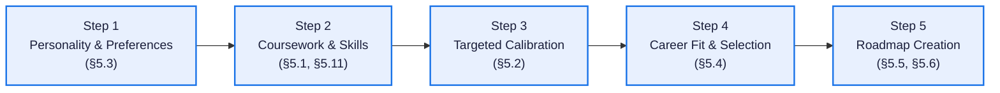
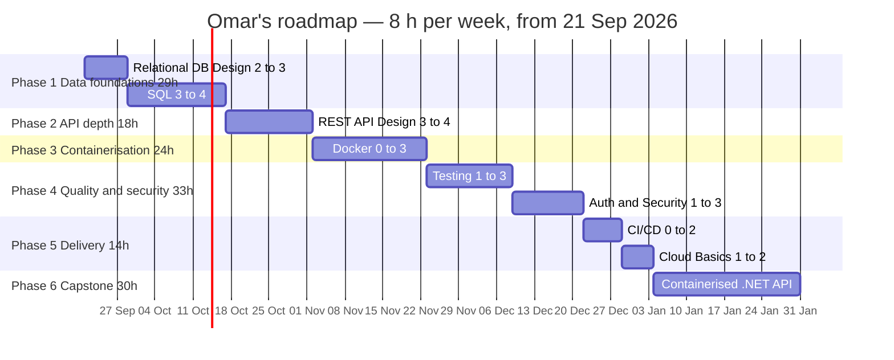
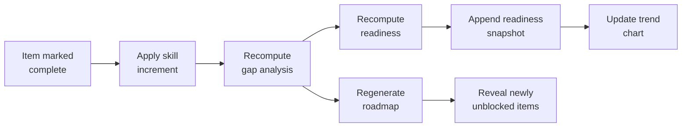

# 05 — MVP Features

**Document owners:** Backend + Frontend · **Status:** Baseline

Every feature below states its purpose, inputs, algorithm, a worked example, its acceptance
criteria, and what happens when a dependency fails. A feature without a stated algorithm is a
feature nobody can implement twice the same way.

---

## Feature index

| § | Feature | Tier | Owner |
|---|---|---|---|
| 5.0 | [Onboarding & Plan Creation Wizard](#50-onboarding--plan-creation-wizard) | MVP | Mazen · Mohamed Y. · Ziad |
| 5.1 | [Student Profile](#51-student-profile) | MVP | Mohamed Y. · Mazen |
| 5.2 | [Skill Calibration Quiz](#52-skill-calibration-quiz) | MVP | Mohamed Y. · Mazen |
| 5.3 | [Career Assessment](#53-career-assessment) | MVP | Mohamed Y. · Mazen |
| 5.4 | [Career Recommendation](#54-career-recommendation) | MVP | **Ahmed Y. (AI)** · Ziad (integration) |
| 5.5 | [**Skill-Gap Analysis**](#55-skill-gap-analysis--core) | **MVP — Core** | Osama · Ziad |
| 5.6 | [**Personalized Roadmap**](#56-personalized-roadmap--core) | **MVP — Core** | Osama · Ziad |
| 5.7 | [Career Readiness Score](#57-career-readiness-score) | MVP | Osama · Mazen |
| 5.8 | [Project Recommendations](#58-project-recommendations) | MVP | Mohamed Y. · Mazen |
| 5.9 | [Progress Tracking](#59-progress-tracking) | MVP | Osama · Mazen |
| 5.10 | [Learning Resources](#510-learning-resources) | MVP | Mohamed Y. · Mazen |
| 5.11 | [University Curriculum Mapping](#511-university-curriculum-mapping) | Should | Mohamed Y. · Mazen |
| 5.12 | [Internship Readiness Checklist](#512-internship-readiness-checklist) | Should | Mohamed Y. · Mazen |
| 5.13 | [Advisor Dashboard](#513-advisor-dashboard) | Should | Osama · Mazen |
| 5.14 | [What-If Target Comparison](#514-what-if-target-comparison) | Should | Osama · Ziad |
| 5.15 | [Explainability Panel](#515-explainability-panel) | Should | Ziad |
| 5.16 | [Admin Content Panel](#516-admin-content-panel) | MVP | Mohamed Y. |

The AI Mentor is specified in [§06](06-ai-engines.md#4-engine-c--context-aware-ai-mentor-rag).

---

## 5.0 Onboarding & Plan Creation Wizard

**Purpose:** guide first-time students through a cohesive, friction-free journey from initial curiosity to an active, personalized roadmap.
**Requirements:** FR-00 · **Story:** US-00 · **Owners:** Mazen · Mohamed Y. · Ziad

### The 5-step sequence



| Step | User Action | System Output | Duration |
|:-:|---|---|:-:|
| **1** | Answers 20 Likert items on interests, problem types, and work preferences | Produces normalized `interest_vector` | ~4 min |
| **2** | Selects academic year and completed Suez Canal courses; adds claimed technical skills on the 0–5 scale | Pre-fills skills via curriculum mapping; initializes `student_skill` records | ~3 min |
| **3** | Completes a targeted diagnostic quiz for the top 2–3 core technical claimed skills with question banks | Computes `calibrated_level` for core claims; remaining claims marked unverified | ~5 min |
| **4** | Reviews ranked careers with match percentages and fit breakdowns; selects target career and track | Persists `target_career_id` and `target_track_id` | ~2 min |
| **5** | Enters available study hours per week (1–60 h) | Runs gap analysis and prerequisite-ordered scheduler; returns first phase and capstone | < 2 s |

### Resume and state recovery

- The student's progress is saved on every answer submission (`onboarding_step` in `STUDENT_PROFILE`).
- If a student closes the browser at Step 3, logging back in automatically resumes at Step 3 with prior answers intact.
- Completing Step 5 sets `onboarding_completed_at` and unlocks the primary dashboard.

---

## 5.1 Student Profile

**Purpose:** establish the input that every other feature consumes.
**Requirements:** FR-01…FR-07 · **Story:** US-01

### Inputs

| Field | Type | Required |
|---|---|---|
| Academic year | 1–5 | Yes |
| Interests | multi-select from a fixed list | Yes, ≥ 3 |
| Skills | skill + level 0–5 | Yes, ≥ 5 |
| Completed courses | multi-select from the seeded catalogue | No |
| Hours available per week | 1–60 | Yes |
| Career goal | free text, ≤ 500 characters | No |
| Evidence URL per skill | URL | No |

### Profile completeness

Shown as a percentage so the student sees what is missing, instead of discovering later that their
results were thin:

```text
completeness = 0.20 · min(skills_rated / 15, 1)
             + 0.15 · min(interests / 5, 1)
             + 0.15 · (academic_year set)
             + 0.15 · (hours_per_week set)
             + 0.20 · min(courses / 8, 1)
             + 0.15 · min(calibrated_skills / 5, 1)
```

Below 60 %, gap analysis still runs but the UI carries a warning that results will be rough. A
partial answer with an honest caveat beats a blocking form.

### Acceptance criteria

US-01 AC1–AC6. Additionally: free text is length-limited and escaped on render
([NFR-10](02-requirements.md#nfr-10--input-handling-and-injection-resistance)), and skill search
matches aliases so typing "Postgres" finds "PostgreSQL".

---

## 5.2 Skill Calibration Quiz

**Purpose:** the cheapest available correction for self-assessment bias — the single largest
validity threat to the whole project.
**Requirements:** FR-09 · **Story:** US-02

Why this exists: if everything downstream rests on "I rate myself 4/5 at SQL", a reviewer can
reasonably dismiss the entire output. A short objective check is not a full assessment, but it moves
the project from *opinion in, opinion out* to *measured, with a stated method*.

### Algorithm

1. The student claims skill `s` at level `L`.
2. Draw 5–8 items for `s` from `QUIZ_ITEM`, stratified around `L`: 2 below, 3 at level, 2 above.
3. Score each item; every item is tagged with the level it probes.
4. **Calibrated level** = the highest level at which the student answered ≥ 70 % of that level's items correctly *and* answered at least one item correctly at every level below it.
5. Store as `calibrated_level`; `effective_level` follows automatically ([§04](04-data-model.md#6-student-data)).
6. If `|calibrated − self| ≥ 2`, show a plain message: *"Your quiz result suggests level 2 rather than 4. We'll plan using level 2 so your roadmap isn't too advanced."*

### Worked example

> Omar claims **SQL = 4**. Items drawn: 2 at level 3, 3 at level 4, 2 at level 5.
> He answers both level-3 items correctly, one of three level-4 items, and neither level-5 item.
> Level-4 accuracy is 33 % (< 70 %); level-3 accuracy is 100 %. **Calibrated = 3.**
> His gap against a Backend requirement of SQL 4 becomes 1 instead of 0 — the honest answer.

### Scope control

Quizzes are authored only for the **~30 most frequently required skills**. Writing 8 items for 160
skills would be 1,280 questions and would consume the entire project. Skills without a quiz use
self-reported levels, flagged as unverified.

### Progressive calibration in the onboarding wizard

To balance assessment validity against onboarding drop-off:

1. **Targeted onboarding check:** When a student reaches Step 3 of the Onboarding Wizard, the system inspects their claimed skills against the ~30 skills with authored quizzes, selecting the **top 2–3 core skills** (e.g. SQL, Git, OOP) based on market demand and claimed proficiency.
2. **Time-boxed micro-diagnostic:** The student takes a short 5–8 item quiz per selected core skill (total ~10–15 questions, ~5 minutes).
3. **On-demand dashboard calibration:** Remaining claimed skills that have quizzes are flagged as *Unverified* with a prompt on the student's dashboard: *"Verify your Docker level with a 3-minute quiz"*. Students can complete these at any time to refine their gap calculations.
4. **Uncalibrated skills:** Skills without quizzes automatically use `effective_level = self_level` with a transparent `source: "self"` badge.

### Fallback

Skipping calibration never blocks anything (US-02 AC5). Unverified skills are marked in the UI so
the student can tell the difference between claimed and checked.

---

## 5.3 Career Assessment

**Purpose:** capture interests and work preferences, which skills alone do not reveal.
**Requirements:** FR-08 · **Story:** US-03

Structure — 20–25 items, under 10 minutes:

| Section | Items | Produces |
|---|---|---|
| Interest areas | 8 | Weighted interest vector |
| Work-style preferences | 5 | Team vs solo, breadth vs depth, product vs research |
| Problem-type preference | 6 | Systems / data / visual / security / infrastructure |
| Career intent | 3 | Employment vs postgraduate study, region, timeline |

Answers are Likert (1–5), so they can be used numerically without pretending to be precise.
Interest weights feed the recommendation's interest term ([§5.4](#54-career-recommendation)) and are
stored, so re-taking the assessment months later produces a comparable result.

---

## 5.4 Career Recommendation

**Purpose:** rank the 6 careers for this specific student, with reasons.
**Requirements:** FR-10, FR-11 · **Story:** US-03 · **Flow:** [§03 7.1](03-architecture.md#71-career-recommendation--model-first-with-a-fastapi-fallback)

### Model-first design

Career recommendation is a model-first pipeline. The primary prediction is produced by the AI
recommendation service, while deterministic logic is limited to mandatory constraints and the
documented fallback path. The .NET backend does not compute the recommendation score.

| Stage | Method | Responsibility | Failure handling |
|---|---|---|---|
| 1 | Embedding | Represent the student profile and career data semantically | FastAPI handles inference failure |
| 2 | Candidate retrieval | Retrieve against the precomputed career vectors supplied by .NET | Uses data supplied by .NET; FastAPI does not access PostgreSQL |
| 3 | Reranker | Produce the primary career relevance/ranking signal | FastAPI may use the documented fallback if inference fails |
| 4 | Mandatory constraints | Enforce hard recommendation conditions | Must not be violated |
| 5 | Final recommendation | Return the final ranked careers and metadata | Returned to .NET |

### Primary model score

The primary `matchScore` is model-driven. The implementation may use embedding representations and
a dedicated reranker; the exact model/checkpoint is recorded separately from this architecture document.
The final score is not defined as a fixed weighted blend with the deterministic baseline.

### Deterministic baseline

The deterministic career-ranking baseline is implemented inside the FastAPI recommendation service
and is retained for two purposes: RQ1 evaluation and the documented fallback when the primary model
pipeline cannot complete. It is not the normal production predictor.

For student `u` and career `c`, the baseline is:

```text
skill_fit(u,c) = Σ_{s ∈ req(c)}  importance(s,c) · min(level(u,s), required(s,c)) / required(s,c)
                 ─────────────────────────────────────────────────────────────────────────────
                                    Σ_{s ∈ req(c)}  importance(s,c)

interest_fit(u,c) = cosine( interest_vector(u), interest_profile(c) )

coverage(u,c)   = |{ s ∈ req(c) : level(u,s) ≥ 1 }| / |req(c)|

baseline(u,c)   = 100 · ( 0.55 · skill_fit + 0.30 · interest_fit + 0.15 · coverage )
```

The baseline score is computed entirely from the recommendation inputs supplied to FastAPI. Its
weights are part of the recommendation-service implementation and are not used to define the
primary model score.

- `skill_fit` is capped per skill, so exceeding a requirement never inflates the score.
- `coverage` rewards breadth across the required skill set.
- OR-groups contribute only their representative member ([§04 5.1](04-data-model.md#51-how-or-groups-are-evaluated)).

The deterministic career-ranking baseline is retained for RQ1 comparison and as the documented
FastAPI fallback when the primary model pipeline cannot complete.

### What crosses the service boundary

FastAPI receives only the recommendation inputs required by the computation, such as the student's
relevant profile/skill data and the candidate career data, including precomputed career embeddings where needed
for retrieval. `.NET` loads those persisted vectors from PostgreSQL before the request. FastAPI does not access
PostgreSQL directly and does not return every intermediate representation. Embeddings, retrieved candidates and
reranker intermediate state remain internal to FastAPI unless a field is explicitly included in the API contract.

### Acceptance criteria

US-03 AC1–AC5. Plus: the public response includes `mode: "model-first" | "fallback"`, and the
primary recommendation computation is performed by the internal FastAPI service.

## 5.5 Skill-Gap Analysis — CORE

**Purpose:** the heart of Masar. Quantify precisely what the student is missing.
**Requirements:** FR-12…FR-15 · **Story:** US-04 · **Owner:** Osama

### The problem with the original definition

The original spec's flagship table classified `SQL 55 % → 85 %` (a 30-point gap on an 85 %-important
skill) as merely "Needs Improvement", while `Testing 35 % → 60 %` (a 25-point gap on a 60 %-important
skill) was "High Priority Gap". No formula was given, and no consistent weighting produces that
ordering. The most important table in the project was internally inconsistent — precisely the thing a
committee will notice.

### Algorithm

For each required skill `s` of the target career + track:

```text
current   = effective_level(u, s)          -- calibrated where available
required  = required_level(s, c, t)
gap       = max(0, required − current)
priority  = gap × importance(s, c)         -- range 0 … 5
satisfaction = min(current, required) / required
```

Severity is a function of `priority` alone, so ordering is guaranteed monotone:

| Severity | Condition | Meaning |
|---|---|---|
| **Strength** | `current > required` | Above requirement |
| **Met** | `gap == 0` | Exactly meets requirement |
| **Minor** | `0 < priority < 0.75` | Worth improving |
| **Moderate** | `0.75 ≤ priority < 1.5` | Should be addressed |
| **Critical** | `priority ≥ 1.5` | Blocking for this career |

Because severity depends only on `priority`, US-04 AC2 holds by construction: no skill with a
larger weighted gap can ever be classified below one with a smaller weighted gap. That is a property
provable by a unit test, not a promise.

### Worked example — Omar, targeting Backend Development (.NET track)

| Skill | Imp. | Required | Current | Gap | **Priority** | Severity |
|---|---:|:-:|:-:|:-:|---:|---|
| Docker | 0.65 | 3 | 0 | 3 | **1.95** | ✖ Critical |
| Testing | 0.75 | 3 | 1 | 2 | **1.50** | ✖ Critical |
| Auth & Security | 0.60 | 3 | 1 | 2 | 1.20 | ▲ Moderate |
| CI/CD | 0.50 | 2 | 0 | 2 | 1.00 | ▲ Moderate |
| REST API Design | 0.90 | 4 | 3 | 1 | 0.90 | ▲ Moderate |
| SQL | 0.85 | 4 | 3 | 1 | 0.85 | ▲ Moderate |
| Relational DB Design | 0.75 | 3 | 2 | 1 | 0.75 | ▲ Moderate |
| Cloud Basics | 0.40 | 2 | 1 | 1 | 0.40 | ● Minor |
| C# / .NET | 0.95 | 4 | 4 | 0 | 0.00 | ✔ Met |
| Linux Basics | 0.45 | 2 | 2 | 0 | 0.00 | ✔ Met |
| Git | 0.80 | 3 | 4 | 0 | 0.00 | ★ Strength |

Every row is machine-checked arithmetic, not illustration. The ordering is strictly monotone in
`priority`, so sorting by severity and sorting by priority yield the same sequence.

Note the OR-group effect: because Omar is at C# 4, the `any_of` primary-language group is satisfied,
so **Python does not appear as a gap at all**. Under the original flat model it would have.

Severity is rendered as **icon + word + colour**, never colour alone
([NFR-05](02-requirements.md#nfr-05--accessibility)).

### Rationale text

Each row carries an explanation assembled deterministically from stored data:

> **Docker** — *Critical.* Appears in 61 % of junior .NET backend postings in the snapshot, and it is
> a prerequisite for CI/CD, which is also in your gap list.

Template: `{skill} — {severity}. Appears in {n}% of {seniority} {career} postings, and {relation}.`
Assembled from `CAREER_SKILL_REQUIREMENT.rationale` plus posting frequency. **No LLM call**, so it
always renders, costs nothing, and cannot hallucinate.

### Fallback

None needed. This feature depends only on the database.

---

## 5.6 Personalized Roadmap — CORE

**Purpose:** convert a set of gaps into a dated, ordered, achievable plan.
**Requirements:** FR-16…FR-19 · **Story:** US-05 · **Owner:** Osama

The original roadmap example contradicted its own gap table: the gaps were Docker, Testing, SQL and
APIs, yet the roadmap contained no API phase and placed Docker third with no stated rule. Here the
roadmap is a **pure function of the gap set and the prerequisite graph**.

### Algorithm

```text
1. candidates ← { s : gap(s) > 0 }
2. Expand: add any missing HARD prerequisite that is not already met
           (a student may need a prerequisite the career itself does not list)
3. Build the induced subgraph of SKILL_PREREQUISITE over candidates
4. Validate acyclicity — cycles cannot occur, because the seed validator rejects them
5. While candidates remain:
      ready ← nodes whose hard prerequisites are all scheduled or already met
      pick  ← max by (priority DESC, estimated_hours ASC, slug ASC)   ← total order ⇒ deterministic
      append pick to the ordered list
6. Pack the ordered list into phases, cap 40 hours per phase,
   never splitting one skill across two phases
7. Compute dates:  phase_weeks = phase_hours / hours_per_week
8. Append a capstone project covering ≥ 3 of the highest-priority gap skills
9. Store input_hash, so identical inputs are provably identical outputs (FR-18)
```

Step 5's three-part sort key is what makes FR-18 satisfiable. Two of the three keys can tie; `slug`
cannot, so the order is total and reproducible across runs, machines, and database row orderings.

### Worked example — Omar, 8 hours/week, starting Mon 21 Sep 2026

Ordering after the topological sort, verified against the prerequisite edges in
[§04 4.2](04-data-model.md#42-prerequisite-graph):

| # | Skill | Levels | Priority | Hours | Hard prereqs inside the gap set |
|---|---|:-:|---:|---:|---|
| 1 | Relational DB Design | 2→3 | 0.75 | 9 | — |
| 2 | SQL | 3→4 | 0.85 | 20 | Relational DB Design |
| 3 | REST API Design | 3→4 | 0.90 | 18 | SQL |
| 4 | Docker | 0→3 | 1.95 | 24 | REST API Design |
| 5 | Testing | 1→3 | 1.50 | 18 | REST API Design |
| 6 | Auth & Security | 1→3 | 1.20 | 15 | REST API Design |
| 7 | CI/CD | 0→2 | 1.00 | 8 | Docker, Testing |
| 8 | Cloud Basics | 1→2 | 0.40 | 6 | — |

**Docker has the highest priority but is scheduled fourth.** That is the design working as intended:
prerequisites outrank priority. It is also exactly the ordering an LLM would get wrong, which is why
step 5 is deterministic code and not a prompt.



**Total: 148 hours ≈ 18.5 weeks at 8 h/week, completing 30 Jan 2027.** Every figure is computed, not
illustrative; the same scheduler run twice reproduces this table exactly.

### Why concrete dates matter

"Learn Docker (8 hours)" is ignorable. "Docker, by 22 November" is a commitment. Dates are what make
the plan behave like a plan, and they cost nothing once hours and a weekly budget exist.

### Fallback

None needed — no AI involved. If `hours_per_week` is missing, the scheduler defaults to 6 and the UI
says so explicitly.

---

## 5.7 Career Readiness Score

**Purpose:** one number the student can watch move. This is the feature that makes "adaptive"
visible instead of asserted.
**Requirements:** FR-13, FR-26 · **Story:** US-04, US-06 · **New in this revision**

### Formula

```text
readiness = 100 · Σ importance(s) · min(current(s), required(s))
                  ────────────────────────────────────────────
                  Σ importance(s) · required(s)
```

Properties that make it defensible:

- **Bounded** in `[0, 100]`, reaching 100 exactly when every requirement is met.
- **Monotone**: improving any skill can only raise it. A student can never be punished for learning.
- **Importance-weighted**: progress on a critical skill moves the number more than progress on a minor one, which is what makes it motivating rather than arbitrary.
- **Capped per skill**, so over-shooting one requirement cannot mask others.

### Worked example — Omar

Using the [§5.5](#55-skill-gap-analysis--core) table:

```text
Σ importance · min(current, required) = 15.60
Σ importance · required               = 24.15
readiness = 100 × 15.60 / 24.15       = 64.60  →  65 %
```

> **"You are 65 % ready for Backend Development (.NET)."**

After completing Phase 1 (Relational DB Design 2→3, SQL 3→4) the numerator rises by
`0.75×1 + 0.85×1 = 1.60` to 17.20, giving **71 %**. A visible +6 for six weeks of work — a real
reward, and a real reason to come back.

### Trend chart

Every recalculation appends a `READINESS_SNAPSHOT` row ([§04](04-data-model.md#6-student-data)).
The dashboard renders the series, with an accessible data table alongside
([NFR-05](02-requirements.md#nfr-05--accessibility)).

This is the single best artefact for the final presentation: one line going up, computed from real
student actions.

---

## 5.8 Project Recommendations

**Purpose:** portfolio evidence, not just consumed courses.
**Requirements:** FR-21, FR-22 · **Story:** US-05

### Selection algorithm

```text
coverage(p) = Σ_{s ∈ skills(p) ∩ gaps(u)}  priority(s)

eligible(p) = ∀ s ∈ skills(p) : current(u,s) ≥ min_level_required(p,s) − 1
              AND difficulty(p) ≤ ceil(mean_current_level(u)) + 1

score(p)    = coverage(p) / sqrt(estimated_hours(p))     -- value per hour invested
```

- The `−1` tolerance lets a project be recommended slightly ahead of the student's level, since projects are how people learn, not proof they already have.
- Dividing by `sqrt(hours)` prefers efficient projects without dismissing large valuable ones outright.
- The **capstone** is the highest-scoring project with `is_capstone_eligible` that covers ≥ 3 gap skills.

### Worked example — Omar

| Project | Gap skills covered | Coverage | Hours | Score |
|---|---|---:|---:|---:|
| **Containerised .NET API with CI** | Docker 1.95, Testing 1.50, CI/CD 1.00, REST API 0.90, SQL 0.85 | **6.20** | 30 | **1.13** |
| Auth service with JWT | Auth 1.20, REST API 0.90, Testing 1.50 | 3.60 | 20 | 0.80 |
| Reporting dashboard | SQL 0.85, Relational DB 0.75 | 1.60 | 14 | 0.43 |

The capstone selection matches the roadmap's final phase, so the plan and the project
recommendation cannot disagree — they read the same gap set.

---

## 5.9 Progress Tracking

**Purpose:** close the adaptive loop. Without this the system is a one-shot report.
**Requirements:** FR-23…FR-26 · **Story:** US-06

### Skill increment rule

The original spec asserted "Docker 20 % → 55 %" on completion with no rule behind it. Stated
explicitly here, because an unstated rule will be implemented three different ways:

| Completed item | Effect on `student_skill` |
|---|---|
| Resource for skill `s`, `from_level → to_level` | `self_level ← max(self_level, to_level)`, `source = 'progress'` |
| Project touching skills `S` | For each `s ∈ S` where `is_primary`: `+1`, capped at the project's `min_level_required + 1` |
| Calibration quiz | `calibrated_level ← quiz result` (overrides, up or down) |

Guards that prevent gaming:

- **Never raise a skill above `required_level + 1`** from progress alone. Completing one Docker course does not make anyone advanced, and the score would lose meaning if it did.
- Marking an item complete has **no effect if it is already complete** — the operation is idempotent.
- **Undo** reverses the increment and reverts derived values (US-06 AC5). Every increment stores the delta it applied, which is what makes the reversal exact rather than approximate.

### Recalculation cascade



The whole cascade runs inside one database transaction. A partial update would leave a student
looking at a gap table and a readiness score that disagree — a bug that erodes trust in every
number on the page.

---

## 5.10 Learning Resources

**Purpose:** make every roadmap item actionable.
**Requirements:** FR-20 · **Story:** US-05

Selection for a roadmap item covering skill `s`, `from → to`:

1. Filter `RESOURCE_SKILL` where `skill_id = s` and `is_primary`.
2. Keep resources whose `level` falls in `[from, to]`.
3. Rank by: `is_free DESC`, `type` preference (`docs` > `course` > `tutorial` > `video` > `article`), then `estimated_hours ASC`.
4. Attach the top resource as primary, plus up to 2 alternates.

Rules:

- **Never LLM-generated** — see [§01](01-project-overview.md#where-ai-sits-precisely).
- All MVP resources are free (`is_free = true`), because the students using Masar have the same $0 budget the team does.
- A monthly link-check job updates `last_verified_at` and flags dead links for an admin.

---

## 5.11 University Curriculum Mapping

**Purpose:** turn a transcript into a starting skill profile. This is the project's clearest
original contribution.
**Requirements:** FR-05 · **Story:** US-11 · **New in this revision**

### How it works

```text
1. Student selects completed courses from the department catalogue
2. For each course, look up COURSE_SKILL (skill, coverage_level, confidence)
3. proposed_level = round(coverage_level × confidence)
4. Where two courses propose the same skill, take the maximum
5. Present as proposals — the student confirms, edits, or rejects each one
6. Confirmed values write to student_skill with source = 'course_map'
```

### Worked example

> Omar selects **CS302 Database Systems** and **CS410 Web Development**.
>
> | Course | Skill | Coverage | Confidence | Proposed |
> |---|---|:-:|---:|:-:|
> | CS302 | SQL | 4 | 0.90 | **4** |
> | CS302 | Relational DB Design | 4 | 0.85 | **3** |
> | CS302 | Query Optimisation | 2 | 0.60 | 1 |
> | CS410 | HTML/CSS | 3 | 0.95 | **3** |
> | CS410 | JavaScript | 3 | 0.80 | **2** |
> | CS410 | REST API Design | 2 | 0.70 | 1 |
>
> Six proposals from two clicks. Omar edits SQL down to 3 because the course was two years ago —
> which is exactly why proposals must never auto-apply.

### Why this is worth the effort

It solves the cold-start problem (a blank profile is the main reason people abandon this kind of
tool), it produces a defensible research contribution, and it gives the Faculty a concrete reason to
care: the mapping is a byproduct showing which market skills the curriculum does and does not cover.

### Dependency and risk

Requires the department's course descriptions (assumption **A1**). If only partial data is available,
map the ~15 core courses; the feature then degrades in coverage, not in correctness.

---

## 5.12 Internship Readiness Checklist

**Purpose:** deliver objective **O8**, which had no feature at all in the original specification.
**Requirements:** FR-30 · **Story:** US-09

```text
INTERNSHIP_CRITERION
  id, career_id, kind, skill_id NULL, min_level NULL, description, weight
  -- kind: 'skill_threshold' | 'portfolio' | 'cv_item' | 'practice'
```

Example — Backend Development:

| Criterion | Type | Omar's status |
|---|---|---|
| Primary language at level ≥ 3 | skill threshold | ✔ C# at 4 |
| SQL at level ≥ 3 | skill threshold | ✔ at 3 |
| REST API at level ≥ 3 | skill threshold | ✔ at 3 |
| Git at level ≥ 3 | skill threshold | ✔ at 4 |
| ≥ 2 projects with a public repository | portfolio | ✖ 1 project |
| ≥ 1 project with automated tests | portfolio | ✖ none |
| CV lists projects with measurable outcomes | cv item | ✖ not recorded |
| Solved ≥ 30 algorithm problems | practice | ✖ not tracked |

> **Not yet internship-ready — 4 of 8 criteria met.**
> Blockers: a second public project, tests on a project, an updated CV.

Every state is derived from data the system already holds. The value is turning "am I ready?" from
anxiety into a checklist with three named actions.

---

## 5.13 Advisor Dashboard

**Purpose:** deliver objective **O9** and give the project an institutional user.
**Requirements:** FR-31…FR-33 · **Story:** US-10 · **New in this revision**

### Cohort gap heatmap

Rows are skills, columns are academic years, and each cell is the mean `priority` across consenting
students, sorted so the worst collective problems surface first.

| Skill | Year 3 | Year 4 | Cohort mean |
|---|---:|---:|---:|
| Docker | 1.82 | 1.41 | **1.62** |
| Testing | 1.65 | 1.28 | **1.47** |
| CI/CD | 1.44 | 1.10 | 1.27 |
| Cloud Basics | 1.20 | 0.95 | 1.08 |
| SQL | 0.72 | 0.41 | 0.57 |

### Privacy controls — mandatory, not optional

- Only profiles carrying the relevant consent flag are included ([NFR-08](02-requirements.md#nfr-08--privacy-and-data-protection)).
- **Any cell derived from fewer than 5 students is suppressed** and shown as `—`. In a small cohort an unsuppressed cell can identify one person.
- These endpoints return aggregates only; there is no code path from this view to a student row.
- Individual profiles are visible only where the student explicitly opted in.

### Why this earns its place

It answers "who else would use this?", gives Dr. Hend a reason to engage with the running system, and
produces a strong slide: *"the cohort's largest collective gap is Docker — here is the evidence."*

---

## 5.14 What-If Target Comparison

**Purpose:** let a student compare before committing.
**Requirements:** FR-15 · **Story:** US-08

Runs the same gap and readiness calculation against a non-persisted target.

| | Backend (.NET) | Data Engineering |
|---|---:|---:|
| Readiness | **65 %** | 48 % |
| Critical gaps | 2 | 5 |
| Hours to close | 148 | 240 |
| Estimated finish at 8 h/week | Jan 2027 | May 2027 |

Cheap to build, because it reuses the two core engines with `persist = false`. High value, because
"48 % versus 65 %, and four extra months" is a decision a student can actually make.

---

## 5.15 Explainability Panel

**Purpose:** make every recommendation interrogable. This is what separates a defensible system from
a black box.
**Story:** supports US-03 AC2 and US-04 AC3

Every output exposes a "Why?" affordance:

| Output | What the panel shows |
|---|---|
| Career rank | The three score terms, top contributing skills, top contributing interests, and whether the semantic stage ran |
| Gap severity | `gap × importance = priority`, the threshold that produced the class, and the posting frequency behind `importance` |
| Roadmap order | The prerequisite chain that forced this position, and the priority that broke the tie |
| Project choice | Which gap skills it covers, and its coverage-per-hour score |
| Readiness | Numerator, denominator, and the largest single contributor to the shortfall |

Building this forces the algorithms to *be* explainable, which is the real benefit. A committee will
ask "why did it recommend that?" — this panel answers it on screen, live.

---

## 5.16 Admin Content Panel

**Purpose:** let the team and the supervisor manage content without writing SQL.
**Requirements:** FR-34…FR-36

CRUD for skills, aliases, prerequisites, careers, tracks, requirements, resources, projects, quiz
items and courses. Plus:

- **Prerequisite cycle checker**, with an error message naming the offending edges.
- **Seed / reset** for staging.
- **Link-check report** listing resources that failed verification.
- **AI usage counter** against the daily ceiling ([NFR-09](02-requirements.md#nfr-09--abuse-and-cost-control)).
- **Coverage report**: skills with no resource, careers with no project, skills with no quiz. This is how a data gap gets found before a student finds it.

Admin-only, enforced server-side ([NFR-07](02-requirements.md#nfr-07--authorization)).

Curating 160 skills, 350 resources and 60 projects through raw SQL would be slower and more error
prone than building this panel — which is why it is MVP rather than a nice-to-have.

---

**Next:** [06 — AI Engines](06-ai-engines.md)
