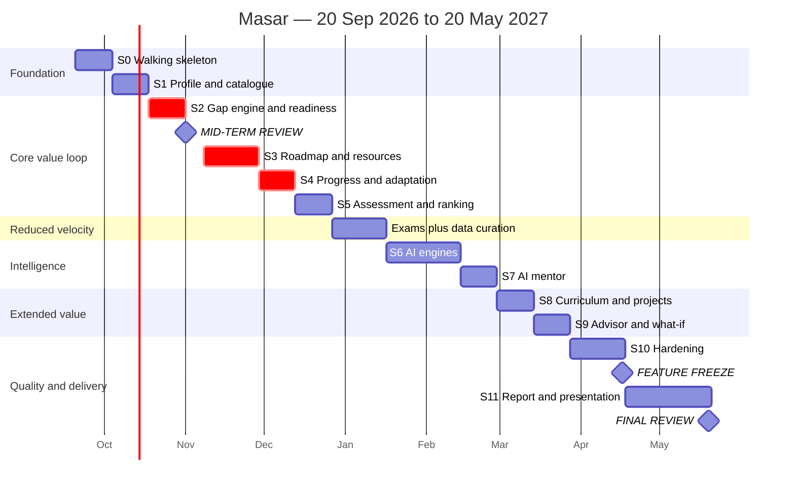

# 08 — Plan & Timeline

**Document owner:** Abdelrahman Megahed · **Status:** Baseline

**Start:** Sun 20 Sep 2026 · **Mid-term review:** Sun 1 Nov 2026 (Week 7) ·
**Final review:** Thu 20 May 2027 (Week 35) · **35 weeks total**

---

## 1. Two changes from the original plan

**Vertical slices, not horizontal layers.** The original Phase 2 built the Skill-Gap engine and
Roadmap generator, while Phase 3 built the Student Profile, Assessment and Career Recommendation
that feed them. You cannot compute a gap before a profile exists, so Phase 2 would have stalled or
been built against fake data and reworked. Every slice below is **independently demonstrable
end-to-end**, which means there is always something to show at a review and integration risk is paid
down continuously rather than all at once in April.

**Real dates.** The original plan had five unnumbered phases and no dates at all, for a project with
a fixed defence. Every slice here has a week range, and the two immovable dates work backwards from
the deadline.

---

## 2. Priority matrix — single source of truth

The original document contained this list three times with contradictions: `GitHub Profile Analysis`
appeared as both 🔵 Should-Have and ⚪ Later, and Resume Builder / ATS / Interview Simulator were
listed in both tiers. **One row per feature, here, and nowhere else.**

| Feature | Tier | Owner | Depends on | Demo-critical | Fallback if it fails |
|---|---|---|---|:-:|---|
| **Skill-Gap Analysis** | 🔴 Core | Osama | Profile, Career DB | **Yes** | None — pure computation |
| **Roadmap Generation** | 🔴 Core | Osama | Gap, prereq DAG | **Yes** | None — pure computation |
| Student Profile | 🟡 MVP | Mohamed Y. | Skill catalogue | Yes | — |
| Career & Skill Database | 🟡 MVP | Mohamed Y. | Seed data | Yes | Hand-curated from O\*NET/ESCO |
| Career Recommendation (baseline) | 🟡 MVP | Osama | Profile, Assessment | Yes | None — deterministic |
| Career Assessment | 🟡 MVP | Mohamed Y. | — | Yes | — |
| Calibration Quiz | 🟡 MVP | Mohamed Y. | Quiz items | No | Self-report only, flagged |
| Career Readiness Score | 🟡 MVP | Osama | Gap | **Yes** | None |
| Learning Resources | 🟡 MVP | Mohamed Y. | Curated seed | Yes | — |
| Project Recommendations | 🟡 MVP | Mohamed Y. | Gap, project seed | Yes | — |
| Progress Tracking | 🟡 MVP | Osama | Roadmap | **Yes** | None |
| Admin Content Panel | 🟡 MVP | Mohamed Y. | — | No | Direct SQL (slow, error-prone) |
| Demo Mode | 🟡 MVP | Mohamed Salah | Fixtures | **Yes** | — |
| Job-Skill Extraction | 🟡 MVP *(offline)* | Ahmed Y. | Job corpus | No | Alias dictionary + taxonomy weights |
| Semantic Re-rank | 🟡 MVP *(enhancer)* | Ahmed Y. | Embeddings | No | Baseline ranking only |
| AI Mentor | 🔵 Should | Ziad + Ahmed Y. | Gap, roadmap, LLM | No | Templated explanations |
| Curriculum Mapping | 🔵 Should | Mohamed Y. | Course catalogue | No | Reduced course subset |
| Internship Readiness | 🔵 Should | Mohamed Y. | Gap | No | — |
| Advisor Dashboard | 🔵 Should | Osama | Gap, consent | No | — |
| What-If Comparison | 🔵 Should | Osama | Gap | No | — |
| Explainability Panel | 🔵 Should | Ziad | All engines | No | — |
| Evidence on skill claims | ⚪ Later | — | Profile | No | — |
| GitHub Profile Analysis | ⚪ Later | — | Evidence slots | No | — |
| Résumé Builder / ATS | ⚪ Later | — | Profile | No | — |
| Interview Simulator | ⚪ Later | — | Gap, LLM | No | — |
| Real Job Matching | ⚪ Later | — | Employer data | No | — |
| Calendar Integration | ⚪ Later | — | Roadmap dates | No | — |
| Mobile App | ⚪ Later | — | API | No | Responsive web |
| Large-Scale Scraping | ⚪ Later | — | — | No | Frozen snapshot |

### Tier definitions

| Tier | Meaning |
|---|---|
| 🔴 **Core** | The project has no demonstrable value proposition without this. Only two features qualify. |
| 🟡 **MVP** | Required for a complete MVP. The project is "done at MVP level" when all of these work. |
| 🔵 **Should** | Materially better product. Built after the MVP is stable and deployed. |
| ⚪ **Later** | Out of scope. Listed so nobody proposes them as if they were new ideas in March. |

> **Two features are 🔴, not four.** The original marked Semantic Matching and NLP Extraction as
> MVP-Core, which made the demo depend on the two least predictable components. Both are now
> enhancers with named fallbacks, and neither is on the demo path.

---

## 3. Slice plan

Each slice ends with something a person can use. "Deployed to staging" is part of done, not a later step.

### Slice 0 — Walking skeleton · **W1–W2 · 20 Sep – 3 Oct**

The riskiest work first: prove all three services talk to each other before any feature exists.

| Task | Owner |
|---|---|
| Repository, branch protection, PR template, `.gitignore` | Abdelrahman |
| `docker compose`: web + api + ai + postgres(pgvector) | Mohamed Salah |
| CI: build, test, lint for all three services | Mohamed Salah |
| Docs CI: markdownlint + link check | Mohamed Salah |
| .NET solution scaffold, 4 projects, dependency rules enforced | Mohamed Yasser |
| React + TS + Vite scaffold, routing, layout shell | Ziad, Mazen |
| FastAPI scaffold with `/health` and `/ready` | Ahmed Yousef |
| Auth: register, login, JWT, refresh, roles | Mohamed Yasser |
| **[API contract](07-api-contract.md) drafted and frozen** | Abdelrahman |
| Design system: colours, type, spacing, accessible components | Yousef Khaled |
| Staging deploy, both services + database, auto from `main` | Mohamed Salah |

**Done when:** a student registers on the deployed staging URL, logs in, sees an empty dashboard, and
the API's health check confirms it reached both the database and the AI service.

> The contract freeze at the end of W2 is what unblocks parallel work for the following 30 weeks.
> It is the highest-leverage two hours in the whole project.

### Slice 1 — Profile and skill catalogue · **W3–W4 · 4–17 Oct**

| Task | Owner |
|---|---|
| Seed 60 skills + aliases (first pass, expanded later) | Mohamed Yasser, Mazen |
| Skill catalogue endpoints with alias search | Mohamed Yasser |
| Profile CRUD, skills, interests, hours/week | Mohamed Yasser |
| Profile UI: skill picker with level definitions on screen | Mazen |
| Completeness indicator | Mazen |
| Consent settings UI and endpoints | Mohamed Yasser, Mazen |
| Wireframes for gap and roadmap screens | Yousef Khaled |
| **Prerequisite DAG: first 60 skills + cycle validator** | Osama |

**Done when:** a student builds a real profile and it persists.

### Slice 2 — Careers, gap engine, readiness · **W5–W6 · 18–31 Oct**

The core of the project, deliberately placed before the mid-term review.

| Task | Owner |
|---|---|
| Seed 6 careers, tracks, OR-groups, requirements | Mohamed Yasser |
| `GapCalculator` + `ReadinessCalculator` in Domain, with unit tests | **Osama** |
| Gap and readiness endpoints | Osama |
| Gap table UI: severity as icon + text + colour, sortable | Ziad |
| Readiness score display | Mazen |
| Deterministic rationale text generator | Osama |
| Target career selection | Mohamed Yasser, Mazen |
| **Demo mode with fixed fixtures** | Mohamed Salah |

**Done when:** a student picks Backend Development and sees a correct, explained gap table plus a
readiness score.

### 🎯 Milestone — Mid-term review · **Sun 1 Nov 2026 (W7)**

Six weeks in. What is shown:

1. A student registers and builds a profile — live, on the deployed URL.
2. They select a target career.
3. **The gap analysis appears with severity, priority and per-skill rationale.**
4. **A readiness score of 65 % is shown, with the arithmetic behind it.**
5. The architecture and the reasoning behind the deterministic core.

What is honestly reported as not yet built: roadmap, resources, projects, progress, AI mentor.

> Reaching a working **core value loop by week 6** is what makes the remaining 28 weeks a matter of
> extending a working system rather than hoping it integrates. Under the original horizontal plan,
> week 6 would have produced database schemas and scaffolding with nothing to show.

### Slice 3 — Roadmap and resources · **W8–W10 · 8–28 Nov**

| Task | Owner |
|---|---|
| `PrerequisiteGraph` topological sort, deterministic tie-break | **Osama** |
| `RoadmapScheduler`: phase packing, hour budget, dates | **Osama** |
| `input_hash` determinism test | Osama |
| Roadmap endpoints | Osama |
| Seed 150 free resources for the first 60 skills | Mohamed Yasser, Mazen |
| Resource selection algorithm | Mohamed Yasser |
| Roadmap UI: phases, items, dates, resource links | Ziad |
| Blocked-by display, so ordering is explained in place | Ziad |

**Done when:** a student sees a dated, prerequisite-correct roadmap with a working resource link on
every item.

### Slice 4 — Progress and the adaptive loop · **W11–W12 · 29 Nov – 12 Dec**

| Task | Owner |
|---|---|
| Skill increment rules with guards and idempotency | Osama |
| Recalculation cascade in one transaction | Osama |
| Undo with exact delta reversal | Osama |
| Readiness snapshot history | Osama |
| Progress UI: mark complete, undo | Mazen |
| Readiness trend chart + accessible table | Mazen |
| Newly-unblocked item highlighting | Ziad |

**Done when:** completing an item raises the readiness score, redraws the roadmap, and moves the
trend chart. **This is the slice that makes "adaptive" real.**

### Slice 5 — Assessment and recommendation · **W13–W14 · 13–26 Dec**

| Task | Owner |
|---|---|
| Assessment questionnaire, 22 items | Mohamed Yasser |
| `MatchScorer` baseline in Domain, with unit tests | Osama |
| Recommendation endpoint with score breakdown | Osama |
| Assessment UI with incremental save | Mazen |
| Ranked results with per-career reasons | Mazen |
| Calibration quiz items for the top 15 skills | Mohamed Yasser, Ahmed Y. |
| Quiz delivery and calibration scoring | Mohamed Yasser |

**Done when:** a student takes the assessment and receives an explained ranking without ever choosing
a career manually.

### ⏸ Reduced velocity — exams · **W15–W17 · 27 Dec – 16 Jan**

Assume roughly 40 % capacity. Deliberately scheduled for low-coupling work that tolerates interruption.

| Task | Owner |
|---|---|
| Expand skills 60 → 140, with aliases | Mohamed Yasser, Mazen |
| Expand resources 150 → 300 | Mazen, Yousef K. |
| Seed 50 projects | Mohamed Yasser |
| Collect and freeze the job corpus, 500+ postings | **Ahmed Yousef** |
| Manually label 100 postings for evaluation | Ahmed Yousef, Ziad |
| Usability test round 1, 5 students | **Yousef Khaled** |
| Report: introduction, related work, methodology draft | Abdelrahman |

> Data curation and corpus collection are perfect exam-period work: valuable, parallelisable, and
> harmless if someone disappears for four days.

### Slice 6 — AI engines · **W18–W21 · 17 Jan – 13 Feb**

| Task | Owner |
|---|---|
| Extraction pipeline, layers 1–4 | **Ahmed Yousef** |
| Extraction evaluation against the labelled set ([RQ2](09-evaluation.md#rq2--how-accurate-is-skill-extraction)) | Ahmed Yousef |
| Compute importance weights from the corpus | Ahmed Yousef |
| Embedding service, seed-time generation, pgvector storage | Ahmed Yousef |
| Semantic re-rank + [RQ1](09-evaluation.md#rq1--does-semantic-matching-beat-keyword-matching) measurement | Ahmed Yousef |
| AI service client with timeout, retry, fallback | Ziad |
| Degraded-mode UI indicator | Ziad |
| AI service deployed as a private service | Mohamed Salah |

**Done when:** importance weights come from real postings, the hybrid ranking is measured against the
baseline, and killing the AI service degrades the system gracefully instead of breaking it.

### Slice 7 — AI mentor · **W22–W23 · 14–27 Feb**

| Task | Owner |
|---|---|
| Sanitised context DTO with a field allow-list | **Ziad** |
| RAG prompt construction + injection hardening | Ahmed Yousef |
| LLM provider abstraction ([ADR-0002](adr/0002-llm-provider.md)) | Ziad |
| Output validation | Ahmed Yousef |
| Templated fallback for all intents | Ziad |
| Rate limiting and the quota counter | Mohamed Yasser |
| Mentor chat UI with citations | Ziad |
| Mentor grounding evaluation ([RQ4](09-evaluation.md#rq4--is-the-mentor-grounded)) | Ahmed Yousef |

**Done when:** the mentor answers with numbers from the student's own data, cites them, and still
answers usefully with the LLM disconnected.

### Slice 8 — Curriculum mapping and projects · **W24–W25 · 28 Feb – 13 Mar**

| Task | Owner |
|---|---|
| Obtain the department course catalogue | **Abdelrahman** (with Dr. Hend) |
| Author the course → skill map, supervisor-validated | Mohamed Yasser, Ahmed Y. |
| Derive-skills endpoint returning proposals | Mohamed Yasser |
| Course selection + proposal-review UI | Mazen |
| Project recommendation algorithm and capstone selection | Mohamed Yasser |
| Project UI with gap-coverage display | Mazen |

**Done when:** selecting two courses proposes six skills, and the student confirms or edits each one.

### Slice 9 — Advisor, internship readiness, what-if · **W26–W27 · 14–27 Mar**

| Task | Owner |
|---|---|
| Advisor role, aggregate endpoints, n < 5 suppression | **Osama** |
| Cohort heatmap UI + CSV export | Mazen |
| Internship criteria seed + evaluation | Mohamed Yasser |
| Internship checklist UI | Mazen |
| What-if preview endpoint and comparison UI | Osama, Ziad |
| Explainability panel across all outputs | Ziad |

**Done when:** an advisor account sees a cohort heatmap with no individual identifiable, and a student
can compare two targets side by side.

### Slice 10 — Hardening · **W28–W30 · 28 Mar – 17 Apr**

| Task | Owner |
|---|---|
| E2E tests, one per user story | **Ziad** |
| Domain coverage to ≥ 80 % | Osama, Mohamed Y. |
| Accessibility audit against [NFR-05](02-requirements.md#nfr-05--accessibility) | **Yousef Khaled** |
| Keyboard-only and screen-reader pass on core screens | Yousef Khaled |
| Performance: verify [NFR-01](02-requirements.md#nfr-01--performance), remove N+1 queries | Osama |
| Security review: every endpoint's authorization checked | Abdelrahman, Mohamed Y. |
| i18n extraction: zero hard-coded strings, RTL layout check | Mazen |
| Usability test round 2 and fixes | Yousef Khaled |
| Load test at 50 concurrent users | Mohamed Salah |
| Backup and restore rehearsal | Mohamed Salah |

**Done when:** all tests pass, the accessibility audit has no critical findings, and every endpoint's
authorization has been individually verified.

### 🔒 Feature freeze · **Fri 17 Apr 2027 (end of W30)**

No new features after this date — only bug fixes, documentation and presentation work.
**Five weeks of margin before the defence**, because something always goes wrong and margin is the
only thing that absorbs it.

### Slice 11 — Report, presentation, defence · **W31–W35 · 18 Apr – 20 May**

| Week | Focus | Owner |
|---|---|---|
| W31 | Full report draft, all chapters | Abdelrahman + all |
| W31 | Evaluation results written up ([§09](09-evaluation.md)) | Ahmed Yousef |
| W32 | Supervisor review and revisions | All |
| W32 | Architecture and algorithm diagrams finalised | Abdelrahman, Yousef K. |
| W33 | Slide deck, demo script, demo-mode rehearsal | All |
| W33 | Bug fixes arising from the review only | Osama, Mohamed Y. |
| W34 | **Full dress rehearsal, timed, network disconnected** | All |
| W34 | Final report submission | Abdelrahman |
| W35 | Buffer and defence | All |

### 🎓 Final review · **Thu 20 May 2027 (W35)**

---

## 4. Timeline overview

---

## 5. Milestones

| Milestone | Date | Week | Definition of done |
|---|---|:-:|---|
| Walking skeleton | 3 Oct 2026 | 2 | Auth works on deployed staging; all three services connected; API contract frozen |
| **Core value loop** | 31 Oct 2026 | 6 | Profile → target → gap → readiness, live |
| **Mid-term review** | **1 Nov 2026** | **7** | The above demonstrated to the supervisor |
| Full MVP loop | 12 Dec 2026 | 12 | Roadmap, resources, progress, adaptive re-planning |
| MVP complete | 26 Dec 2026 | 14 | Assessment and recommendation included |
| Intelligence integrated | 27 Feb 2027 | 23 | Extraction, embeddings and mentor, all with fallbacks |
| Should-haves complete | 27 Mar 2027 | 27 | Curriculum mapping, advisor, internship, what-if |
| Quality gate | 17 Apr 2027 | 30 | Tests, accessibility, performance and security verified |
| **Feature freeze** | **17 Apr 2027** | **30** | No new features |
| Report submitted | 15 May 2027 | 34 | Final document delivered |
| **Final review** | **20 May 2027** | **35** | Defence |

---

## 6. Definition of Done

A task is done only when **all** of these hold. No exceptions, including near a deadline — that is
exactly when skipped steps cause the most damage.

- [ ] Code merged to `main` via a reviewed PR
- [ ] Unit tests for new domain logic; integration tests for new endpoints
- [ ] Every acceptance criterion of the linked user story passes
- [ ] Reachable from the UI — no orphaned endpoints
- [ ] Authorization verified: another student's data is provably inaccessible
- [ ] Deployed to staging and manually exercised there
- [ ] `docs/` updated if behaviour changed
- [ ] No new lint or build warnings
- [ ] Keyboard-navigable, labelled, and not colour-only for meaning
- [ ] Loading and error states implemented — never a blank screen

A slice is done when every task is done **and** the "Done when" statement is demonstrable on staging
by someone who did not build it.

---

## 7. RACI by workstream

**R**esponsible · **A**ccountable · **C**onsulted

| Workstream | R | A | C |
|---|---|---|---|
| Architecture & integration | Abdelrahman | Abdelrahman | All |
| API contract | Abdelrahman | Abdelrahman | Mohamed Y., Ziad |
| Data model & migrations | Mohamed Yasser | Mohamed Yasser | Osama, Abdelrahman |
| **Gap engine & scheduler** | **Osama** | Osama | Mohamed Y., Abdelrahman |
| Seed data curation | Mohamed Yasser | Mohamed Yasser | Mazen, Yousef K., Dr. Hend |
| Prerequisite DAG | Osama | Osama | Ahmed Y., Dr. Hend |
| AI extraction & embeddings | Ahmed Yousef | Ahmed Yousef | Ziad |
| AI mentor | Ziad | Ahmed Yousef | Abdelrahman |
| Evaluation & user study | Ahmed Yousef | Ahmed Yousef | Yousef K., Dr. Hend |
| Frontend architecture | Ziad | Ziad | Mazen, Yousef K. |
| Design system & UX | Yousef Khaled | Yousef Khaled | Ziad, Mazen |
| Accessibility | Yousef Khaled | Yousef Khaled | Mazen, Ziad |
| CI/CD & deployment | Mohamed Salah | Mohamed Salah | Abdelrahman |
| QA & test strategy | Ziad | Ziad | Mohamed Salah |
| Security review | Abdelrahman | Abdelrahman | Mohamed Y., Mohamed Salah |
| Report & presentation | Abdelrahman | Abdelrahman | All, Dr. Hend |

Every MVP-critical workstream has one named accountable person plus at least one consulted backup.
Abdelrahman appears in eleven rows deliberately: integration and contract ownership were entirely
unassigned in the original plan, and that is where multi-person projects usually fail.

---

## 8. Working agreements

### Branches and reviews

- `main` is protected: no direct pushes, CI must pass, ≥ 1 approving review.
- Branch names: `feat/s3-roadmap-scheduler`, `fix/gap-severity-rounding`, `docs/update-api-contract`.
- Keep PRs under roughly 400 changed lines. A 2,000-line PR is not reviewed, it is waved through.
- Every PR description states what changed, which FR/US it satisfies, and how it was tested.

### Rhythm

| Cadence | Event | Duration |
|---|---|---|
| Twice weekly | Async written standup: done / next / blocked | — |
| Weekly | Team sync: demo the week's work on staging | 45 min |
| End of slice | Slice review: walk through the "Done when" statement | 30 min |
| Fortnightly | Supervisor update: progress, risks, decisions needing input | 30 min |
| Monthly | Risk register review ([§10](10-risks-and-assumptions.md)) | 20 min |

**Blocked for more than 24 hours is escalated to Abdelrahman.** Silent blocking is the most common
way a student project loses two weeks.

### Tracking

GitHub Issues plus one Project board. Every issue carries a slice label, an FR/US reference, and one
assignee. An unassigned issue is not scheduled work — it is a wish.

---

## 9. Contingency

If a slice overruns, cut in this exact order. Deciding now prevents an arbitrary, panicked decision in April.

| Order | Cut | Consequence |
|---|---|---|
| 1 | Explainability panel breadth — keep it for gap only | Less polish; the core explanation survives |
| 2 | What-if comparison | Students commit to a target without previewing alternatives |
| 3 | Advisor dashboard | Objective O9 becomes future work, stated honestly |
| 4 | Internship checklist | Objective O8 becomes future work |
| 5 | Curriculum mapping | **Loses the strongest novelty claim** — cut only under real pressure |
| 6 | AI mentor → templates only | The mentor still answers; it is simply not LLM-generated |
| 7 | Calibration quiz | Self-report only, with the validity limitation stated plainly |

**Never cut:** gap analysis, roadmap generation, readiness score, progress tracking, demo mode. Those
five *are* the project.

If a slice overruns by more than one week, raise it at the next supervisor update instead of absorbing
it silently. A schedule problem surfaced in week 12 is manageable; the same problem surfaced in week 30
is not.

---

**Next:** [09 — Evaluation](09-evaluation.md)
