# Sprint 01 Kickoff & Slice 0 Alignment Meeting

- **Date:** Saturday, 3 October 2026
- **Time:** 19:00 CLT (50 minutes)
- **Location:** Google Meet / Discord Voice
- **Facilitator:** Abdelrahman Megahed (@amegahed12)
- **Goal:** Align all 8 team members on repository governance, architecture boundaries, and launch **Sprint 1 (Slice 0: Walking Skeleton)** to establish a fully working end-to-end multi-service pipeline by the end of the sprint.

---

## 1. Attendees & Workstream Roles

| Member                  | GitHub Handle      | Primary Role              | Sprint 1 Focus                                                |
| -------------------------| --------------------| ---------------------------| ---------------------------------------------------------------|
| **Abdelrahman Megahed** | `@amegahed12`      | Team Lead · Full-Stack    | Repo governance, API contract freeze, integration             |
| **Mohamed Salah**       | `@mohamedsalah770` | DevOps                    | Docker compose, CI workflows, staging deploy                  |
| **Mohamed Yasser**      | `@Eldax23`         | .NET Backend              | .NET solution scaffold, auth & JWT subsystem                  |
| **Osama Mohammed**      | `@OsamaELhendawy`  | .NET Backend              | Review backend architecture, prepare Slice 1/2 algorithms     |
| **Ziad Ahmed**          | `@ziad-Ahmed401`   | Frontend · AI Integration | React 19 + Vite setup, routing shell, API client              |
| **Mazen Oraby**         | `@Mazen-Oraby`     | Frontend                  | React dashboard shell, layout components, state store         |
| **Ahmed Yousef**        | `@AhmedYoussef935` | AI / ML                   | FastAPI service scaffold, `/health` & `/ready`, model loading |
| **Yousef Khaled**       | `@YUSUFU0`         | UI/UX                     | Figma tokens, color palette, WCAG AA contrast (no code)        |

---

## 2. Pre-Meeting Preparation Checklist (Every Member Must Complete)

Before joining the meeting, please ensure:

- [ ] **GitHub Access Verified:** You can clone `https://github.com/Masar-SCU/Masar.git` and have push/PR permissions.
- [ ] **Docs Reviewed:** Read [01 — Project Overview](../docs/01-project-overview.md), [03 — Architecture](../docs/03-architecture.md), and [08 — Plan & Timeline](../docs/08-plan-and-timeline.md).
- [ ] **Local Tools Installed:**
  - Docker Desktop / Docker Engine & Docker Compose v2.
  - Git (configured with your name & email).
  - Your runtime SDK:
    - **Backend:** .NET 8 SDK.
    - **Frontend:** Node.js 20+ & npm.
    - **AI Service:** Python 3.12 & Poetry/venv.
- [ ] **Task Assigned:** Review your assigned issue in GitHub Milestones → [Slice 0: Walking Skeleton](https://github.com/Masar-SCU/Masar/milestones).

---

## 3. Meeting Agenda (50 Minutes Total)

```mermaid
gantt
    title Kickoff Agenda Breakdown (50 min)
    dateFormat mm
    axisFormat %M min

    section Vision & Strategy
    Why Vertical Slices Matter (10 min) :00, 10m
    
    section Technical Alignment
    Architecture & Boundary Rules (15 min) :10, 15m
    
    section Sprint 1 Distribution
    Slice 0 Tasks & DoD Walkthrough (15 min) :25, 15m
    
    section Agreements & Lock-in
    Decisions, Q&A & Commitments (10 min) :40, 10m
```

### Part 1: Why We Build Vertical Slices (00:00 – 00:10)

- **The Pitfall:** In horizontal layering, backend builds models for 6 weeks, frontend builds static mocks, AI runs separate notebooks, and integration fails in April.
- **The Solution:** Every slice in Masar is demonstrable end-to-end on a live staging URL.
- **Sprint 1 Definition of Success:** A user registers on staging, logs in, lands on an empty dashboard shell, and the API health probe confirms it communicates with both Postgres (pgvector) and the AI service.

### Part 2: Architecture & Inviolable Rules (00:10 – 00:25)

1. **The Three-Service Language Boundary:**
   - **.NET 8 Web API:** Owns all state, database connections, and business logic.
   - **Python FastAPI:** Stateless compute only (embeddings & skill extraction). Never touches the DB.
   - **React 19 SPA:** Presentation only. Never talks directly to the AI service.
2. **Domain Layer Purity:**
   - `Masar.Domain` contains **zero external packages**, zero EF Core references, and no I/O.
   - Core calculators (`GapCalculator`, `ReadinessCalculator`, `RoadmapScheduler`) are pure functions.
3. **API Contract Discipline:**
   - Backend and frontend agree on [07 — API Contract](../docs/07-api-contract.md).
   - Freeze date: End of Week 2. After freezing, contract changes require team consensus.
4. **Security & Zero Budget:**
   - Never commit passwords, tokens, or connection strings.
   - Service-to-service communication is secured via `X-Masar-Service-Key`.
   - Free-tier hosting with mandatory automated weekly database dumps.

### Part 3: Sprint 1 (Slice 0) Issues Review (00:25 – 00:40)

Review all open issues in Milestone 1:

| Issue | Title | Assignee | Deliverable |
|---|---|---|---|
| [#3](https://github.com/Masar-SCU/Masar/issues/3) | Repo Governance, PR & Issue Templates | `@amegahed12` | PR/Issue templates, CODEOWNERS, rules |
| [#4](https://github.com/Masar-SCU/Masar/issues/4) | Docker Compose Multi-Service Setup | `@mohamedsalah770` | Working `docker compose up` with 4 containers |
| [#5](https://github.com/Masar-SCU/Masar/issues/5) | CI Pipeline (Build, Test, Lint) | `@mohamedsalah770` | GitHub Actions workflow for all 3 services |
| [#6](https://github.com/Masar-SCU/Masar/issues/6) | Docs CI Verification Workflow | `@mohamedsalah770` | Automated markdownlint, link, and mermaid checks |
| [#7](https://github.com/Masar-SCU/Masar/issues/7) | .NET Solution Architecture Scaffold | `@Eldax23` | Clean 4-project structure + dependency rules |
| [#8](https://github.com/Masar-SCU/Masar/issues/8) | Auth Subsystem (JWT, Refresh, Roles) | `@Eldax23` | Register/login endpoints + auth guards |
| [#9](https://github.com/Masar-SCU/Masar/issues/9) | React 19 + TypeScript + Vite Scaffold | `@ziad-Ahmed401` | Shell layout, routing, JWT interceptor |
| [#10](https://github.com/Masar-SCU/Masar/issues/10) | FastAPI AI Service Scaffold | `@AhmedYoussef935` | `/health`, `/ready`, model boot caching |
| [#11](https://github.com/Masar-SCU/Masar/issues/11) | Design System Tokens & Radix Components | `@YUSUFU0` (Design) + `@Mazen-Oraby` (Code) | Figma design spec by Yousef; Tailwind/React code by Mazen |
| [#12](https://github.com/Masar-SCU/Masar/issues/12) | Freeze API Contract (v1) | `@amegahed12` | DTO signoff + TypeScript type generation |
| [#13](https://github.com/Masar-SCU/Masar/issues/13) | Staging Deployment Setup | `@mohamedsalah770` | Continuous deployment from `main` to staging |

### Part 4: Working Agreements & Commitments (00:40 – 00:50)

1. **Branch Naming:**
   - Must follow: `feat/<slice>-<short-description>`, `fix/<issue>`, or `docs/<update>`.
   - Examples: `feat/s0-docker-compose`, `feat/s0-auth-jwt`, `docs/api-contract-v1`.
2. **Pull Request Protocol:**
   - PR titles must follow Conventional Commits: `feat(...)`, `fix(...)`, `docs(...)`.
   - Keep PRs concise (< 400 lines) so reviews are fast and thorough.
   - At least 1 approving review required before merge.
3. **Definition of Done (DoD):**
   - No code is "done" until it is merged into `main`, covered by tests, deployed to staging, and verified there.
4. **Standups:**
   - Every Sunday & Wednesday morning, post your 3 bullets (Done / Next / Blocked) in the group.
   - Escalation: Blocked > 24 hours = immediately ping Abdelrahman.

---

## 4. Key Decisions to Lock In During Tomorrow's Meeting

| # | Topic | Proposed Decision | Discussion / Consensus Needed |
|---|---|---|---|
| **D1** | **Free Postgres Provider** | Render / Supabase / Neon / Railway | Confirm support for PostgreSQL 16 + `pgvector` extension ([Assumption A7](../docs/10-risks-and-assumptions.md#3-assumptions-register)). |
| **D2** | **Directory Structure** | Monorepo layout: `/src/backend`, `/src/frontend`, `/src/ai`, `/docker` | Confirm agreement across all workstreams. |
| **D3** | **API Contract Freeze** | Target freeze date: End of Week 2 | Signoff on DTO schemas for Slices 0 & 1. |
| **D4** | **Async Standup Time** | Sunday & Wednesday by 12:00 PM CLT | Commitment from all 8 members. |

---

## 5. Live Action Items (To Fill During Meeting)

| # | Action Item | Assignee | Target Date | Status |
|---|---|---|---|---|
| 1 | Test local Docker Compose with all 4 services | `@mohamedsalah770` | 2026-10-05 | Pending |
| 2 | Initial PR for .NET Solution architecture | `@Eldax23` | 2026-10-06 | Pending |
| 3 | Initial PR for React Vite shell layout | `@ziad-Ahmed401` | 2026-10-06 | Pending |
| 4 | Initial PR for FastAPI AI service scaffold | `@AhmedYoussef935` | 2026-10-06 | Pending |
| 5 | Verify pgvector extension on staging host | `@mohamedsalah770` | 2026-10-07 | Pending |
| 6 | Publish TypeScript interfaces from API contract | `@amegahed12` | 2026-10-08 | Pending |
